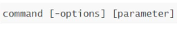

## 计算机由哪两个主要部分组成？

硬件和软件

## 操作系统是什么？有什么作用？

操作系统是软件的一类。

主要作用是协助用户调度硬件工作，充当用户和计算机硬件之间的桥梁。

## 常见的操作系统有哪些？

PC端：Windows、Linux、MacOS

移动端：Android、IOS、鸿蒙系统

## Linux的诞生

Linux由林纳斯 托瓦兹在1991年创立并发展至今成为服务器操作系统领域的核心系统。

## 什么是Linux系统的内核

内核提供了Linux系统的主要功能，如硬件调度管理的能力。

Linux内核是免费开源的，任何人都可以查看内核的源代码，甚至是贡献源代码。

## 什么是Linux系统发行版

内核无法被用户直接使用，需要配合应用程序才能被用户使用。

在内核之上，封装系统级应用程序，组合在一起就称之为Linux发行版。

发行版众多，课程主要基于`CentOS`辅以`Ubuntu`进行讲解。

## 什么是虚拟机？

通过虚拟化技术，在电脑内，虚拟出计算机硬件，并给虚拟的硬件安装操作系统，即可得到一台虚拟的电脑，称之为虚拟机。

## 为什么要使用虚拟机？

学习Linux系统，需要有Linux系统环境。我们不能给自己电脑重装系统为Linux，所以通过虚拟机的形式，得到可以用的Linux系统环境，供后续学习使用。

## 什么是图形化操作，什么是命令行操作？

- 图形化操作是指使用操作系统附带的图形化页面，以图形化的窗口形式获得操作反馈，从而对操作系统进行操作、使用
- 命令行操作是指使用各种命令，以文字字符的形式获得操作反馈，从而对操作系统进行操作、使用

## 为什么Linux操作系统要选择命令行形式呢？

- Linux操作系统的图形化页面不好用且不稳定
- 使用命令行的形式操作更加高效且稳定资源占用低
- 企业和开发者都选择命令行，所以我们也学习命令行


## 为什么使用FinalShell连接Linux去使用

- 操作Linux系统中间跨越VMware窗口会导致交互不太方便

- 我们只需要使用命令行无需使用图形化，所以通过命令行远程连接使用即可

  

## 如何查看Linux的IP地址并远程连接呢

- 在Linux操作系统中，桌面空白右键点击：open in terminal

- 输入ifconfig，即可看到IP地址

- 在FinalShell中配置好IP地址，账号密码后即可连接成功

  

## 快照有什么作用？

快照可以保存虚拟机的状态，当虚拟机出现问题的时候，可以通过预先制作的快照恢复到制作时候的状态，用作备份用。


## 请根据语言描述，写出对应的Linux路径

在根目录下有一个文件夹test，文件夹内有一个文件`hello.txt`，请描述文件的路径

```
/test/hello.txt
```


在根目录下有一个文件hello.txt，请描述文件的路径

```
/hello.txt
```


在根目录下有一个文件夹itcast，在itcast文件夹内有文件夹hello，在hello文件夹内有文件hello.txt，请描述文件的路径

```
/itcast/hello/hello.txt
```

## 什么是命令、命令行？

- 命令：即 Linux 操作指令，是系统内置的程序，可以以字符化的形式去使用。
- 命令行：即 Linux终端，可以提供字符化的操作页面供命令执行。


## Linux命令的通用格式



- 命令本体：即命令本身
- 可选选项：控制命令的行为细节
- 可选参数：控制命令的指向目标

## ls命令的作用是？

在命令行中，以平铺的形式，展示当前工作目录（默认HOME目录）下的内容（文件或文件夹）


## HOME目录是？

每一个用户在Linux系统的专属目录，默认在：`/home/用户名`


## 当前工作目录？

Linux命令行在执行命令的时候，需要一个工作目录，打开命令行程序（终端）默认设置工作目录在用户的HOME目录


## ls命令的参数的作用

可以指定要查看的文件夹(目录)的内容，如果不给定参数，就查看当前工作目录的内容


## ls命令的选项：

- `-a`选项，可以展示出隐藏的内容
  - 以 `.`开头的文件或文件夹默认被隐藏，需要`-a`才能显示出来
- `-l`选项，以列表的形式展示内容，并展示更多细节
- `-h`选项，需要和`-l`选项搭配使用，以更加人性化的方式显示文件的大小单位

## 命令的选项组合使用

- 命令的选项是可以组合使用的，比如: `ls -lah`，等同于 `ls -a -l -h`


## cd命令的作用

- cd命令来自英文：Change Directory
- cd命令可以切换当前工作目录，语法是：
  - 没有选项，只有参数，表示目标路径
  - 使用参数，切换到指定路径
  - 不使用参数，切换工作目录到当前用户的HOME

## pwd命令的作用

- pwd命令来自英文：Print Work Directory
- pwd命令，没有选项，没有参数，直接使用即可
- 作用是：输出当前所在的工作目录


## 当前工作目录内有一个test文件夹，文件夹内有一个文件hello.txt，请描述文件的相对路径

```
test/hello.txt
```


## 在当前工作目录的上级目录有一个test文件夹，文件夹内有一个文件hello.txt，请描述文件的相对路径

```
../test/hello.txt
```


## 在HOME目录内有一个test文件夹，文件夹内有一个文件hello.txt，请描述文件的路径，需要使用符号~

```
~/test/hello.txt
```


## 在根目录下创建目录aa

```
[root@bogon ~]# mkdir aa
```


## 在根目录下创建一个文件cc,然后把cc拷贝到aa下

```

```


## 在根目录下创建目录jinke

- 在根目录下创建目录jinke
- 在根目录下创建一个文件jinkejiaoyu,然后把jinkejiaoyu拷贝到jinke下。
- 更改目录`jinke`的权限为`666`，然后查看是否更改成功。
- 创建用户`quanzhan`，更改目录`jinke`的拥有者和组群都为`quanzhan`，然后查看是否更改成功 。


## 用命令把当前工作目录切换到"/root"，并用命令查看是否切换成功。

- 用命令新建文件"`testfile`"，然后为其创建软链接和硬链接文件，查看其`inode`编号、文件类型、文件权限、连接计数、大小等属性。
- 创建文件`file1`，并将`file1`改为`file2`，然后将文件`file2`移动到目录`/tmp`下，并查看是否移动成功。


## 查找系统命令pwd指令文件的位置。

```
[root@bogon temp]# which pwd
```


## 查找whereis文件，且只将二进制文件查找出来。

```
[root@bogon temp]# find / -name 'whereis'

find: ‘/proc/49688’: No such file or directory
find: ‘/proc/49720’: No such file or directory
find: ‘/run/user/1000/gvfs’: Permission denied
/usr/bin/whereis
/usr/share/bash-completion/completions/whereis

[root@bogon temp]# cat /usr/bin/whereis
```


## 查找和pwd相关的所有文件。

```
[root@bogon temp]# find / -name 'pwd'
```


## 搜索etc目录下所有以sh开头的文件。

```
[root@bogon temp]# find /etc -name 'sh*'

/etc/shells
/etc/profile.d/sh.local
/etc/selinux/targeted/active/modules/100/shorewall
/etc/shadow
/etc/shadow-
/etc/sane.d/sharp.conf

```


## 建立目录/tmp/a/b/c,若不存在目录/tmp/a及/tmp/a/b,则自动建立。

```
[root@bogon /]# mkdir -p /tmp/a/b/c
```


## 用vim编辑器在/tmp下新建一个文件名kangboerjisuanji插入如下内容：

```
abcdefg
1234567
ABCDEFG
zyxwvuts
7654321
ZYXWVUTS 
```

1. 显示文档每一行行号
2. 删除第二行中的第3到6个字符并撤销操作
3. 复制第二行，并粘贴到第6行

```

[root@bogon /]# vim tmp/jinkejiaoyu

  1 abcdefg
  2 1234567
  3 ABCDEFG
  4 zyxwvuts
  5 7654321
  6 ZYXWVUTS
~                                                                                           
~                                                                                           
~                                                                                           
~                                                                                           
~                                                                                           
~                                                                                           
~                                                                                           
~                                                                                           
~                                                                                           
~                                                                                           
~                                                                                           
~                                                                                           
~                                                                                           
~                                                                                           
~                                                                                           
~                                                                                           
~                                                                                           
~                                                                                           
~                                                                                           
~                                                                                           
~                                                                                           
~                                                                                           
~                                                                                           
~                                                                                           
~                                                                                           
~                                                                                           
~                                                                                           
~                                                                                           
~                                                                                           
~                                                                                           
~                                                                                           
~                                                                                           
~                                                                                           
~                                                                                           
~                                                                                           
~                                                                                           
~                                                                                           
~                                                                                           
:set nu 
:wq
```


## 创建目录/data/oldboy ，并且在该目录下创建文件 oldboy.txt，然后在文件 oldboy.txt 里写入内容"inet addr:10.0.0.8  Bcast:10.0.0.255  Mask:255.255.255.0”(不包含引号)

 

```
mkdir -p /data/oldboy/

touch oldboy.txt

echo "inet addr:10.0.0.8  Bcast:10.0.0.255 Mask:255.255.255.0" > oldboy.txt

echo "my name is oldboy" >> oldboy.txt
```


## 将oldboy .txt文件移动到/tmp 目录下，并将/etc/passwd 文件复制到/tmp/oldboy下

```
mv /data/oldboy   /temp

cp /etc/passwd   /temp/oldboy
```


## 
