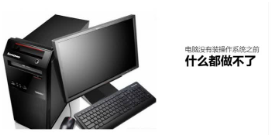

## 操作系统的概述

### 计算机：由软件和硬件组成。

#### 硬件：计算机系统中由电子，机械和光电元件等组成的各种物理装置的总称

#### 软件：是用户和计算机硬件之间的接口和桥梁，用户通过软件与计算机进行交流。`操作系统`就是软件的一类。

### `操作系统`

#### `操作系统`是计算机软件的一种

​		主要负责：作为用户和计算机硬件之间的桥梁，调度和管理计算机硬件进行工作。计算机，如果没有操作系统就是一堆无法使用的塑料而已。

当计算机拥有了操作系统，就相当于拥有了灵魂，操作系统可以：

- 调度CPU进行工作

- 调度内存进行工作

- 调度硬盘进行数据存储

- 调度网卡进行网络通讯

- 调度音响发出声音

- 调度打印机打印内容

  

  

  

  #### 常见操作系统

​		不管是PC操作系统还是移动操作系统其功能都是：调度硬件进行工作充当用户和硬件之间的桥梁。

##  初识Linux

### Linux的诞生

Linux创始人: 林纳斯 托瓦兹

Linux诞生于1991年，作者上大学期间

​		创始人在上大学期间经常需要浏览新闻和处理邮件，发现现有的操作系统不好用,于是他决心自己写一个保护模式下的操作系统，这就是Linux的原型，当时他21岁，后来经过全世界网友的支持,现在能够兼容多种硬件，成为最为流行的服务器操作系统之一。

### Linux内核

Linux系统的组成如下：

- Linux系统内核
- 系统级应用程序

- 内核提供系统最核心的功能，如：调度CPU、调度内存、调度文件系统、调度网络通讯、调度IO等。
- 系统级应用程序，可以理解为出厂自带程序，可供用户快速上手操作系统，
  - 文件管理器、任务管理器、图片查看、音乐播放等

- 比如，播放音乐，无论用户使用自带音乐播放器或是自行安装的第三方播放器
- 均是由播放器程序，调用内核提供的相关功能，由内核调度CPU解码、音响发声等。

### Linux内核

​		内核是Linux操作系统最核心的所在，系统级应用程序只是锦上添花。Linux内核是免费开源的，任何人都可以下载内核源码并查看且修改。

可以通过：https://www.kernel.org	去下载Linux内核

### Linux发行版

​		内核是免费、开源的，这也就代表了：

- 任何人都可以获得并修改内核，并且自行集成系统级程序

- 提供了内核+系统级程序的完整封装，称之为Linux发行版

  

  任何人都可以封装Linux，目前市面上由非常多的Linux发行版，常用的、知名的如下：

  

  我们将基于：

  - 主要基于CentOS操作系统进行讲解
  - 辅助讲解Ubuntu系统的相关知识

  不同的发行版：

  - 基础命令100%是相同的（课程讲解内容）
  - 部分操作不同（如软件安装）

## 虚拟机介绍

虚拟机

学习Linux系统，就需要有一个可用的Linux系统。

如何获得？将自己的电脑重装系统为Linux？

NoNo。这不现实，因为Linux系统并不适合日常办公使用。

我们需要借助虚拟机来获得可用的Linux系统环境进行学习。

### 虚拟机

借助虚拟化技术，我们可以在系统中，通过软件：模拟计算机硬件，并给虚拟硬件安装真实的操作系统。

这样，就可以在电脑中，虚拟出一个完整的电脑，以供我们学习Linux系统。

## VMware WorkStation安装

### 虚拟化软件

通过虚拟化技术，可以虚拟出计算机的硬件，那么如何虚拟呢？

我们可以通过提供虚拟化的软件来获得虚拟机。

### VMware WorkStation

课程选用VMware WorkStation软件来提供虚拟机。

下载地址：https://www.vmware.com/cn/products/workstation-pro.html

秘钥：VM17:
MC60H-DWHD5-H80U9-6V85M-8280D

### 安装虚拟机软件`VMware` 

#### 双击打开`exe`软件安装程序

#### 出现以下界面，点击`下一步`

#### 点击`我接受许可协议中的条款`，然后点击`下一步`

####  点击`更改`选择安装在合适的盘符中（请保证自己的盘符预留30G的空间预算），接着点击`下一步`

#### 点击`下一步`

#### 点击`下一步`

#### 点击`安装`

#### 虚拟机软件`VMware`安装成功 

#### 点击完成，`双击桌面`此软件图标

#### 软件`正常运行`

### 检测虚拟机网卡是否可用

快捷键：`win + r`输入`ncpa.cpl`回车即可打开

网络连接显示有`VMnet1`和`VMnet8`则表明`网络功能正常`

## 在VMware中安装CentOS操作系统

### 下载`CentOS`操作系统

首先，我们需要下载操作系统的安装文件，本次使用CentOS7.6版本进行学习。

https://vault.centos.org/7.6.1810/isos/x86_64/

- 点击上面的`链接`，对`红框的文件`点击进行下载。

- 或者直接使用如下链接下载：

  https://vault.centos.org/7.6.1810/isos/x86_64/CentOS-7-x86_64-DVD-1810.iso

### 在`VMware`中安装`CentOS`操作系统

#### 打开`VMware`软件

#### 在`VMware`中安装`CentOS`操作系统，按照步骤创建虚拟机：

#### 点击`完成`后，即开启了`CentOS`系统的安装，耐心等待安装完成即可，后续都是自动化的。

##### 点击用户名：

##### 输入密码：

#### 体验Linux的快乐吧。

## 远程连接Linux系统

### 图形化、命令行

对于操作系统的使用，有2种使用形式：

- 图形化页面使用操作系统

- 以命令的形式使用操作系统

  不论是Windows还是Linux亦或是MacOS系统，都是支持这两种使用形式。

- 图形化：使用操作系统提供的图形化页面，以获得图形化反馈的形式去使用操作系统。

- 命令行：使用操作系统提供的各类命令，以获得字符反馈的形式去使用操作系统。

#### Windows系统的图形化和命令行

#### Linux系统的图形化和命令行

### 使用命令行学习`Linux`系统

尽管图形化是大多数人使用计算机的第一选择，但是在Linux操作系统上，这个选择被反转了。

无论是企业开发亦或是个人开发，使用Linux操作系统，多数都是使用的：**命令行**。

这是因为：

- Linux从诞生至今，在图形化页面的优化上，并未重点发力。所以Linux操作系统的图形化页面：不好用、不稳定。
- 在开发中，使用命令行形式，效率更高，更加直观，并且资源占用低，程序运行更稳定。

### `FinalShell`

命令行去学习Linux操作系统，那么就必须丰富一下工具的使用。

使用VMware可以得到Linux虚拟机，但是在VMware中操作Linux的命令行页面不太方便，主要是：

- 内容的复制、粘贴跨越VMware不方便
- 文件的上传、下载跨越VMware不方便
- 也就是和Linux系统的各类交互，跨越VMware不方便

我们可以通过第三方软件，FinalShell，远程连接到Linux操作系统之上。并通过FinalShell去操作Linux系统。这样各类操作都会十分的方便。

​	FinalShell的下载地址为：

​	Windows:

​			http://www.hostbuf.com/downloads/finalshell_install.exe

​	Mac:

​			http://www.hostbuf.com/downloads/finalshell_install.pkg

​	下载完成后双击打开安装。

#### `Windows`系统安装`FinalShell`

按照提示一直下一步即可安装完成。

### 连接到`Linux`系统

#### 首先，先查询到`Linux`系统的`IP`地址

#### 打开Finshell软件，配置到Linux系统的连接

#### 按图示配置连接，并点击确定

#### 打开连接管理器

#### 点击接受并保存

#### 如图连接成功

## 虚拟机快照

### 虚拟机快照介绍

在学习阶段我们无法避免的可能损坏Linux操作系统。

如果损坏的话，重新安装一个Linux操作系统就会十分麻烦。

VMware虚拟机（Workstation和Funsion）支持为虚拟机制作快照。

通过快照将当前虚拟机的状态保存下来，在以后可以通过快照恢复虚拟机到保存的状态。

### 虚拟机快照使用说明（在VMware Fusion Pro中制作并还原快照）

快照制作需要虚拟机关机状态下（不关机也可以，但是比较慢，建议关机）

