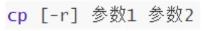

## Linux的目录结构

Linux的目录结构是一个树型结构

Windows系统可以拥有多个盘符,如C盘、D盘、E盘

Linux没有盘符这个概念,只有一个根目录/,所有文件都在它下面


### Linux路径的描述方式

在Linux系统中，路径之间的层级关系，使用：/ 来表示

在Windows系统中，路径之间的层级关系，使用：\ 来表示


注意：

- D:表示D盘
- \表示层级关系


注意：

- 开头的/表示根目录
- 后面的/表示层级关系


## Linux命令入门


### 什么是命令、命令行

学习Linux，本质上是学习在命令行下熟练使用Linux的各类命令

- 命令行：即`Linux`终端（Terminal），是一种命令提示符页面。以纯“字符”的形式操作系统，可以使用各种字符化命令对系统发出操作指令。

- 命令：即Linux程序。一个命令就是一个Linux的程序。命令没有图形化页面，可以在命令行（终端中）提供字符化的反馈。

  


### `Linux`命令基础格式

无论是什么命令，用于什么用途，在Linux中，命令有其通用的格式：


- command：命令本身

- -options：[可选，非必填]命令的一些选项，可以通过选项控制命令的行为细节

- parameter：[可选，非必填]命令的参数，多数用于命令的指向目标等

语法中的`[]`，表示可选的意思


示例：

- ```
  ls -l /home/test, ls是命令本身， -l 是选项， /home/test 是参数
  ```

  - 意思：以列表的形式，显示 `/home/test`目录内的内容

- ```
  cp -r test1 test2 , cp是命令本身，-r 是选项， test1 和 test2 是参数1
  ```

  - 意思：复制文件夹 test1 成为 test2


### `ls`命令

ls命令的作用是列出目录下的内容，语法细节如下：


- -a -l -h是可选的选项
- Linux路径是此命令可选的参数

当不使用选项和参数，直接使用ls命令本体，表示：以平铺形式，列出当前工作目录下的内容


### `HOME`目录和`工作`目录


直接输入ls命令，表示列出当前工作目录下的内容，当前工作目录是？

Linux系统的命令行终端，在启动的时候，默认会加载:

- 当前登录用户的HOME目录作为当前工作目录，所以ls命令列出的是HOME目录的内容
  - HOME目录：每个Linux操作用户在Linux系统的个人账户目录，路径在：/home/用户名
  - 如，图中的Linux用户是yagnfan，其HOME目录是：/home/yangfan
  - Windows系统和Linux系统，均设有用户


### `ls`命令的参数和选项

#### ls命令的`参数`

刚刚展示了，直接使用`ls`命令，并未使用选项和参数。


那么ls的选项和参数具体有什么作用呢？首先我们先来看参数。

- 当ls不使用参数，表示列出：当前工作目录的内容，即用户的HOME目录

- 当使用参数，ls命令的参数表示：指定一个Linux路径，列出指定路径的内容


通过ls /列出了根目录的内容，我们可以打开VMware，在Linux的图形化中对照一下


#### `ls`命令的 `-a` 选项

如下语法，ls命令是可以使用选项的


- `-a`选项，表示：all的意思，即列出全部文件（包含隐藏的文件/文件夹）


可以看到，ls -a对比ls列出的内容更多了。

- 图中以`.`开头的，表示是Linux系统的隐藏文件/文件夹（只要以`.`开头，就能自动隐藏）
- 只有通过`-a`选项，才能看到这些隐藏的文件/文件夹


#### ls命令的`-l`选项


- `-l`选项，表示：以列表（竖向排列）的形式展示内容，并展示更多信息


- `-l`选项其实和图形化中，文件夹以列表形式排列是一个意思


#### ls命令选项的组合使用

语法中的选项是可以组合使用的，比如学习的-a和-l可以组合应用。

写法：

- ls -l -a

- ls -la

- ls -al

上述三种写法，都是一样的，表示同时应用`-l`和`-a`的功能


#### ls命令的`-h`选项

- `-h`表示以易于阅读的形式，列出文件大小，如`K(B)、M(B)、G(B)`老师
- `-h`选项必须要搭配`-l`一起使用


## 目录切换相关命令（cd / pwd）

### `cd`切换工作目录

当Linux终端（命令行）打开的时候，会默认以用户的HOME目录作为当前的工作目录

我们可以通过cd命令，更改当前所在的工作目录。

cd命令来自英文：Change Directory

语法：

- cd命令无需选项，只有参数，表示要切换到哪个目录下
- cd命令直接执行，不写参数，表示回到用户的HOME目录


### `pwd`查看当前工作目录

通过ls来验证当前的工作目录，其实是不恰当的。

我们可以通过`pwd`命令，来查看当前所在的工作目录。

pwd命令来自：Print Work Directory

语法：

- pwd命令，无选项，无参数，直接输入pwd即可


### 课后练习

请使用`cd`命令并结合`ls`命令，任意在`Linux`文件系统内探索

并尝试找出名字叫`games`的文件夹在哪里。


## 相对路径、绝对路径


如图，通过pwd得知当前所在是HOME目录：`/home/yangfan`

现在想要通过cd命令，切换工作目录到`Desktop`文件夹中去。

那么，cd命令的参数（Linux路径）如何写呢？

```
cd /home/yangfan/Desktop
cd Desktop
```

上述两种写法，都可以正确的切换目录到指定的`Desktop`中。


`cd /home/yangfan/Desktop`	绝对路径写法


`cd Desktop`	相对路径写法


绝对路径：以根目录为起点，描述路径的一种写法，路径描述以`/`开头

相对路径：以当前目录为起点，描述路径的一种写法，路径描述无需以`/`开头


## 特殊路径符


如图，当前工作目录处于：/home/yangfan/Desktop

现在想要，向上回退一级，切换目录到/home/yangfan中，如何做？

- 可以直接通过cd，即可回到HOME目录
- 也可以通过特殊路径符来完成。

### 特殊路径符：

- `.`表示当前目录，比如`cd ./Desktop`表示切换到当前目录下的`Desktop`目录内，和`cd Desktop`效果一致
- `..`表示上一级目录，比如：cd ..即可切换到上一级目录，`cd ../..`切换到上二级的目录
- `~`表示`HOME`目录，比如：`cd ~`即可切换到HOME目录或`cd ~/Desktop`，切换到HOME内的Desktop目录
- `/`:根目录


## 创建目录命令

```
小提示:清屏快捷键 ctrl+l
```

### `mkdir`命令

通过mkdir命令可以创建新的目录（文件夹）

mkdir来自英文：Make Directory

语法：

- 参数必填，表示Linux路径，即要创建的文件夹的路径，相对路径或绝对路径均可
- `-p`选项可选，表示自动创建不存在的父目录，适用于创建连续多层级的目录


### mkdir `-p`选项

如果想要一次性创建多个层级的目录，如下图


会报错，因为上级目录itcast和good并不存在，所以无法创建666目录可以通过-p选项，将一整个链条都创建完成。


<font color=red>注意：创建文件夹需要修改权限，请确保操作均在HOME目录内，不要在HOME外操作涉及到权限问题，HOME外无法成功后续我们会讲解权限管控的知识</font>


### 课后练习

请通过命令在HOME目录内，创建如下路径（需使用特殊符号~）：itcast/yangfan/nice/666

```
mkdir -p ~/itcast/itheima/nice/666
```


## 文件操作命令01(touch、cat、more）

### `touch`创建文件

可以通过`touch`命令创建文件

语法：

- `touch`命令无选项，参数必填，表示要创建的文件路径，相对、绝对、特殊路径符均可以使用


### `cat`命令 查看文件内容

有了文件后，我们可以通过`cat`命令查看文件的内容。

不过，现在我们还未学习`vi`编辑器，无法向文件内编辑内容，所以，暂时，我们先通过图形化。

在图形化中，手动向文件内添加内容，以测试cat命令。


准备好文件内容后，可以通过cat查看内容。

语法：

- cat同样没有选项，只有必填参数，参数表示：被查看的文件路径，相对、绝对、特殊路径符都可以使用


### `more`命令查看文件内容

`more`命令同样可以查看文件内容，同`cat`不同的是：

- cat是直接将内容全部显示出来
- more支持翻页，如果文件内容过多，可以一页页的展示

语法：

- 同样没有选项，只有必填参数，参数表示：被查看的文件路径，相对、绝对、特殊路径符都可以使用

Linux系统内置有一个文件，路径为：/etc/services，可以使用more命令查看

```
more /etc/services
```

- 在查看的过程中，通过`空格`翻页
- 通过`q`退出查看


## 文件操作命令02(cp、mv、rm）

### `cp`命令复制文件、文件夹

`cp`命令可以用于复制文件、文件夹，cp命令来自英文单词：copy

语法：

- `-r`选项，可选，用于复制文件夹使用，表示递归
- 参数1，Linux路径，表示被复制的文件或文件夹
- 参数2，Linux路径，表示要复制去的地方


### `mv`移动文件或文件夹

`mv`命令可以用于移动文件\文件夹，`mv`命令来自英文单词：move

语法：

- 参数1，Linux路径，表示被移动的文件或文件夹
- 参数2，Linux路径，表示要移动去的地方，如果目标不存在，则进行改名，确保目标存在

`文件`移动案例：


`文件`改名案例：


`文件夹`移动案例：


### `rm`删除文件、文件夹

`rm`命令可用于删除文件、文件夹

`rm`命令来自英文单词：remove

语法：

- 同`cp`命令一样，`-r`选项用于删除文件夹
- `-f`表示force，强制删除（不会弹出提示确认信息）
  - 普通用户删除内容不会弹出提示，只有root管理员用户删除内容会有提示
  - 一般普通用户用不到`-f`选项
- 参数1、参数2、......、参数N表示要删除的文件或文件夹路径，按照空格隔开

`删除文件`案例：


`删除多个文件`案例：


`删除文件夹`案例：


`删除多个文件夹`案例：


### `rm`删除文件、文件夹`-`通配符

`rm`命令支持通配符`*`，用来做模糊匹配

- 符号`*`表示通配符，即匹配任意内容（包含空），示例：
- `test*`，表示匹配任何以test开头的内容
- `*test`，表示匹配任何以test结尾的内容
- `*test*`，表示匹配任何包含test的内容

案例：

- 删除所有以`test`开头的文件或文件夹


- 删除所有以`test`结尾的内容


- 删除包含`test`的所有文件


- 演示强制删除，`-f`选项
- 可以通过`su - root`，并输入密码123456（和普通用户默认一样）临时切换到root用户体验。
- 通过输入`exit`命令，退回普通用户。（临时用root，用完记得退出，不要一直用，关于root我们后面会讲）


#### 注意：`rm`是一个危险的命令，特别是在处于`root`（超级管理员）用户的时候。请谨慎使用。

如下命令，请千万千万不要在root管理员用户下执行：

`rm -rf /`

`rm -rf /*`

效果等同于在Windows上执行C盘格式化。


## 查找命令

### `which`命令

我们在前面学习的Linux命令，其实它们的本体就是一个个的二进制可执行程序。

和`Windows`系统中的`.exe`文件，是一个意思。

我们可以通过`which`命令，查看所使用的一系列命令的程序文件存放在哪里

语法：


### `find`命令-按文件名查找文件

在图形化中，我们可以方便的通过系统提供的搜索功能，搜索指定的文件。


同样，在Linux系统中，我们可以通过find命令去搜索指定的文件。

语法：

为了确保后续演示，拥有最大的权限，可以在整个系统完成搜索

我们可以切换到`root`用户以获得管理员权限

执行命令：su - root

输入密码：123456（和你普通用户的密码一样）


### `find`命令-通配符

根据语法：

被查找文件名，支持使用通配符*来做模糊查询。

- 符号*表示通配符，即匹配任意内容（包含空），示例：
- `test*`，表示匹配任何以test开头的内容
- `*test`，表示匹配任何以test结尾的内容
- `*test*`，表示匹配任何包含test的内容
- 基于通配符的含义，可以结合find命令做文件的模糊查询。


### `find`命令-按文件大小查找文件

语法：

- `+`、`-`表示大于和小于
- n表示大小数字
- kMG表示大小单位，k(小写字母)表示kb，M表示MB，G表示GB

示例：

- 查找小于10KB的文件：find / -size -10k
- 查找大于100MB的文件：find / -size +100M
- 查找大于1GB的文件：find / -size +1G

<font color=red>提示： </font>使用`ctrl+c`终止操作


### 课后练习

- 请使用find命令找出：名称中带有centos的文件


- 请使用find命令找出：/usr目录内大于100M的文件


## grep、wc和管道符

### `grep`命令

可以通过`grep`命令，从文件中通过关键字过滤文件行。

语法：

- 选项`-n`，可选，表示在结果中显示匹配的行的行号。
- 参数，关键字，必填，表示过滤的关键字，带有空格或其它特殊符号，建议使用`""`将关键字包围起来
- 参数，文件路径，必填，表示要过滤内容的文件路径，<font color=red>可作为内容输入端口</font>

通过`touch`命令在HOME目录创建`1.txt`，并通过图形化页面编辑并保存如下内容：


- `grep`命令，过滤`this`关键字


- `grep`命令，过滤`study`关键字


- `grep`命令，过滤`jinkejiaoyu`关键字，并显示行号


### `wc`命令做数量统计

可以通过`wc`命令统计文件的行数、单词数量等

语法：

- 选项，`-c`，统计`bytes`数量
- 选项，`-m`，统计字符数量
- 选项，`-l`，统计行数
- 选项，`-w`，统计单词数量
- 参数，文件路径，被统计的文件，<font color=red>可作为内容输入端口</font>

`练习`

- 不带选项，统计文件


- 选项，`-c`，统计bytes数量


- 选项，`-m`，统计字符数量


- 选项，`-l`，统计行数


- 选项，`-w`，统计单词数量


### 管道符

学习了grep命令后，我们在来学习一个新的特殊符号，管道符：`|`

管道符的含义是：将管道符左边命令的结果，作为右边命令的输入


例子：

- `cat 1.txt` 的输出结果（文件内容）
- 作为右边`grep`命令的输入（被过滤文件）

管道符的应用非常多

- find / -name “test” | grep “/usr/lib64”，过滤结果，只找路径带有/usr/lib64的结果


- 统计`usr/bin` 下的文件数量


## echo、tail和重定向符

### `echo`命令

可以使用`echo`命令在命令行内输出指定内容

语法：`echo 输出的内容`

- 无需选项，只有一个参数，表示要输出的内容，复杂内容可以用`””`包围

案例：

- 在终端上显示：Hello Linux


- 带有空格或\等特殊符号，建议使用双引号包围
  - 因为不包围的话，空格后很容易被识别为参数2，尽管echo不受影响，但是要养成习惯

、


### 反引号`

看一下如下命令：echo pwd


本意是想，输出当前的工作路径，但是pwd被作为普通字符输出了。

我们可以通过将命令用反引号（通常也称之为飘号）`将其包围

被`包围的内容，会被作为命令执行，而非普通字符


### 重定向符

我们再来学习两个特殊符号，重定向符：`>`和`>>`

```
>，将左侧命令的结果，覆盖写入到符号右侧指定的文件中
```

```
>>，将左侧命令的结果，追加写入到符号右侧指定的文件中
```

演示：

- `[yangfan@bogon ~]$ echo 'nihao'> test.txt`，覆盖


- `[yangfan@bogon ~]$ echo 'wobuhao' >> test.txt`，追加


### `tail`命令

使用`tail`命令，可以查看文件尾部内容，跟踪文件的最新更改，语法如下：

```
tail [-f -num] Linux路径
```

- 参数，`Linux`路径，表示被跟踪的文件路径
- 选项，`-f`，表示持续跟踪
- 选项, `-num`，表示，查看尾部多少行，不填默认10行


- 选项, `-num`，表示，查看尾部5行，不填默认10行


- 选项，`-f`，表示持续跟踪


- 在第一个标签中，执行：`touch test.txt`，创建一个`test.txt`文件
- 在第一个标签中，执行：`tail -f test.txt`，持续跟踪文件更改
- 在第二个标签中，多次执行：`echo “内容”>> test.txt`，向文件追加内容
- 观察第一个标签的变化


### 课后练习

- 请使用echo并配合反引号，输出内容：我当前的工作目录是：

- 并结合重定向符，将输出结果覆盖写入`work.txt`文件

  ```
  `具体的工作目录路径`
  echo "我当前的工作目录是：`pwd`" > work.txt
  ```

  

- 请使用`echo`输出任意内容并追加到`work.txt`文件中
- 通过`tail`命令持续跟踪文件内容更改

```
echo "内容" >> work.txt
tail -f work.txt
```


## vi编辑器

### vi\vim编辑器介绍

vi\vim是visual interface的简称,是Linux中最经典的文本编辑器

同图形化界面中的 文本编辑器一样，`vi`是命令行下对文本文件进行编辑的绝佳选择。

<font color=red>vim是vi的加强版本，兼容vi的所有指令，不仅能编辑文本，而且还具有shell程序编辑的功能，可以不同颜色的字体来辨别语法的正确性，极大方便了程序的设计和编辑性。</font>


### `vi\vim`编辑器的三种工作模式

<font color=red>命令</font>模式（Command mode）

​		命令模式下，所敲的按键编辑器都理解为命令，以命令驱动执行不同的功能。

​		此模型下，不能自由进行文本编辑。


<font color=red>输入</font>模式（Insert mode）

​		也就是所谓的编辑模式、插入模式。

​		此模式下，可以对文件内容进行自由编辑。


<font color=red>底线命令</font>模式（Last line mode）

​		以`：`开始，通常用于文件的保存、退出。


### 命令模式

如果需要通过vi/vim编辑器编辑文件，请通过如下命令：

```
vi 文件路径
vim 文件路径
```

`vim`兼容全部的`vi`功能，后续全部使用`vim`命令

- 如果文件路径表示的文件<font color=red>不存在</font>，那么此命令会用于<font color=red>编辑新文件</font>
- 如果文件路径表示的文件<font color=red>存在</font>，那么此命令用于<font color=red>编辑已有文件</font>


### vi编辑器的快速体验

通过`vi/vim`命令编辑文件，会打开一个新的窗口，此时这个窗口就是：命令模式窗口

命令模式是vi编辑器的入口和出口，如右图

- 进入`vi`编辑器会进入命令模式
- 通过命令模式输入键盘指令，可以进入输入模式
- 输入模式需要退回到命令模式，然后通过命令可以进入底线命令模式


快速体验：

1. 用：`vim hello.txt`，编辑一个新文件，执行后进入的是命令模式
2. 在命令模式内，按键盘`i`，进入输入模式
3. 在输入模式内输入：`hello world`
4. 输入完成后，按`esc`回退到命令模式
5. 在命令模式内，按键盘`:`，进入底线命令模式
6. 在底线命令内输入`:wq`，保存文件并退出vi编辑器


### 命令模式快捷键

经过刚刚的快速体验，想必同学们对于3种模式的切换有了一定的了解。

现在我们来看一下，在命令模式下的一些常见快捷键。


### 底线命令模式

编辑模式没有什么特殊的，进入编辑模式后，任何快捷键都没有作用，就是正常输入文本而已。

唯一大家需要记住的，就是：通过esc，可以退回到命令模式中即可。

在命令模式内，输入:，即可进入底线命令模式，支持如下命令：


## 命令的选项

我们学习的一系列Linux命令，它们所拥有的选项都是非常多的。

比如，简单的ls命令就有：

-a -A -b -c -C -d -D -f -F -g -G -h -H -i -I -k -l -L -m -n -N -o -p -q -Q -r-R -s -S -t -T -u -U -v -w -x -X -1等选项，可以发现选项是极其多的。

课程中，并不会将全部的选项都进行讲解，否则，一个ls命令就可能讲解2小时之久。

课程中，会对常见的选项进行讲解，足够满足绝大多数的学习、工作场景。


### 查看命令帮助和手册

如果想要对命令的其它选项进行查阅，可以通过如下方式：

- 任何命令都支持：`--help`选项，可以通过这个选项，查看命令的帮助。

  - 如：`ls --help`，会列出ls命令的帮助文档。

    

    帮助文档会简单的对命令的使用方式进行说明

- 如果想要查看命令的详细手册，可以通过man（manual，手册）命令查看
- 比如：
  - man ls，就是查看ls命令的详细手册
  - man cd，就是查看cd命令的详细手册
  - 大多数手册都是全英文的，如果阅读吃力，可以通过重定向符：`man ls > ls-man.txt`，输出手册到文件然后通过翻译软件翻译内容查看


