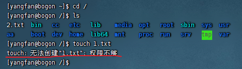
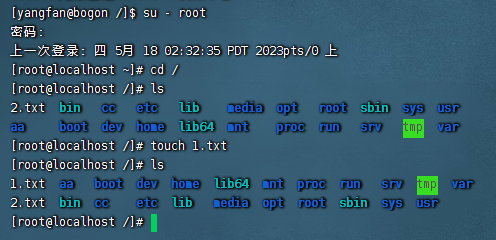
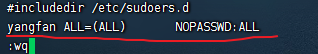
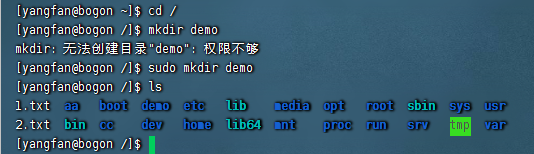

## Linux的root用户

- 学习目标

  1. 了解什么是root用户（超级管理员）
  2. 掌握用户切换命令
  3. 掌握sudo命令

  

### `root`用户（超级管理员）

无论是Windows、MacOS、Linux均采用多用户的管理模式进行权限管理。

- 在Linux系统中，拥有最大权限的账户名为：root（超级管理员）
- 而在前期，我们一直使用的账户是普通的用户：yangfan


root用户拥有最大的系统操作权限，而普通用户在许多地方的权限是受限的。

演示：

- 使用普通用户在根目录下创建文件夹



- 切换到root用户后，继续尝试



- <font color=red>普通用户的权限，一般在其HOME目录内是不受限的</font>
- <font color=red>一旦出了HOME目录，大多数地方，普通用户仅有只读和执行权限，无修改权限</font>


### `su`和`exit`命令

在前面，我们接触过su命令切换到root账户。su命令就是用于账户切换的系统命令，其来源英文单词：`Switch User`

语法：

```
su [-] [用户名]
```

- `-`符号是可选的，表示是否在切换用户后加载环境变量（后续讲解），建议带上
- 参数：用户名，表示要切换的用户，用户名也可以省略，省略表示切换到`root`
- 切换用户后，可以通过`exit`命令退回上一个用户，也可以使用快捷键：`ctrl + d`


- 使用普通用户，切换到其它用户<font color=red>需要输入密码</font>，如切换到root用户
- 使用root用户切换到其它用户，<font color=red>无需密码</font>，可以直接切换


### `sudo`命令

在我们得知root密码的时候，可以通过su命令切换到root得到最大权限。

但是我们不建议长期使用root用户，避免带来系统损坏。

我们可以使用sudo命令，为普通的命令授权，临时以root身份执行。

语法：

```
sudo 其他命令
```

- 在其它命令之前，带上sudo，即可为这一条命令临时赋予root授权
- 但是并不是所有的用户，都有权利使用sudo，我们<font color=red>需要为普通用户配置sudo认证</font>


### 为普通用户配置`sudo`认证

- 切换到root用户，执行`visudo`命令，会自动通过vi编辑器打开：/etc/sudoers
- 在文件的最后添加：



- 其中最后的NOPASSWD:ALL表示使用sudo命令，无需输入密码
- 最后通过wq保存


- 切换回普通用户



- 执行的命令，均以root运行


### 总结

1. Linux系统的超级管理员用户是：root用户

2. su命令

   - 可以切换用户，语法：

   - ```
     su [-] [用户名]
     ```

   - `-`表示切换后加载环境变量，建议带上

   - 用户可以省略，省略默认切换到root

3. sudo命令

   - 可以让一条普通命令带有root权限，语法：

   - ```
     sudo 其他命令
     ```

   - 需要以root用户执行visudo命令，增加配置方可让普通用户有sudo命令的执行权限

     


