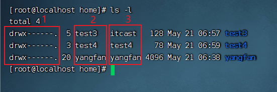
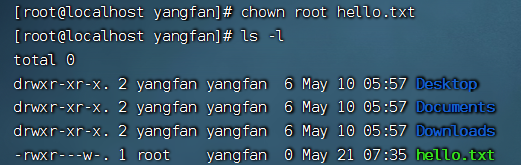

## 用户、用户组管理

### 用户、用户组


Linux中关于权限的管控级别有2个级别，分别是：

- 针对用户的权限控制
- 针对用户组的权限控制

比如，针对某文件，可以控制用户的权限，也可以控制用户组的权限。

所以，我们需要学习在Linux中进行用户、用户组管理的基础命令，为后面学习权限控制打下基础。


### 用户组管理

- 创建用户组

```
groupadd 用户组名
```

- 删除用户组

```
groupdel 用户组名
```

为后续演示，我们创建一个itcast用户组：groupadd itcast


### 用户管理

以下命令需`root`用户执行

#### 创建用户

```
useradd [-g -d] 用户名
```


1. 选项：`-g`指定用户的组，不指定`-g`，会创建同名组并自动加入，指定-g需要组已经存在，如已存在同名组，必须使用`-g`
2. 选项：`-d`指定用户HOME路径，不指定，HOME目录默认在：/home/用户名


#### 删除用户

```
userdel [-r] 用户名
```


1. 选项：`-r`，删除用户的HOME目录，不使用`-r`，删除用户时，HOME目录保留

   

#### 查看用户所属组

```
id [用户名]
```

1. 参数：用户名，被查看的用户组，如果不提供则查看自身

   

   

#### 修改用户所属组

```
usermod -aG 用户组 用户名，将指定用户加入指定用户组
```


### getent

#### 查看用户

使用`getent`命令，可以查看当前系统中有哪些用户

语法：

```
getent passwd
```


```
用户名:密码(x):用户ID:组ID:描述信息(无用):HOME目录:执行终端(默认bash)
```


#### 查看组

使用`getent`命令，同样可以查看当前系统中有哪些用户组

语法：

```
getent group
```


```
包含3份信息，组名称:组认证(显示为x):组ID
```


## 查看权限控制

### 认知权限信息

通过`ls -l`可以以列表形式查看内容，并显示权限细节



- 序号1，表示文件、文件夹的权限控制信息
- 序号2，表示文件、文件夹所属用户
- 序号3，表示文件、文件夹所属用户组

#### 解析一下`序号1`，权限细节，权限细节总共分为10个槽位


举例：`drwxr-xr-x`，表示：

- 这是一个文件夹，首字母d表示
- 所属用户(右上角图序号2)的权限是：有r有w有x，rwx
- 所属用户组(右上角图序号3)的权限是：有r无w有x，r-x（-表示无此权限）
- 它用户的权限是：有r无w有x，r-x


### rwx

- r表示读权限（read）
- w表示写权限（write）
- x表示执行权限

针对文件、文件夹的不同，rwx的含义有细微差别

- r，针对文件可以查看文件内容
  - 针对文件夹，可以查看文件夹内容，如ls命令
- w，针对文件表示可以修改此文件
  - 针对文件夹，可以在文件夹内：创建、删除、改名等操作
- x，针对文件表示可以将文件作为程序执行
  - 针对文件夹，表示可以更改工作目录到此文件夹，即cd进入


## 修改权限控制- chmod

我们可以使用`chmod`命令，修改文件、文件夹的权限信息。

<font color=red>注意，只有文件、文件夹的所属用户或root用户可以修改。</font>

语法：

```
chmod -[R] 权限 文件或文件夹
```

- 选项：-R，对文件夹内的全部内容应用同样的操作


### 实例：

```
chmod u=rwx,g=rx,o=x hello.txt，将文件权限修改为：rwxr-x--x
```

- 其中：u表示user所属用户权限，g表示group组权限，o表示other其它用户权限


```
chmod -Ru=rwx,g=rx,o=x test，将文件夹test以及文件夹内全部内容权限设置为：rwxr-x--x
```


除此之外，还有快捷写法：

```
chmod 751 hello.txt
```

将hello.txt的权限修改为751

<font color=red> 那么问题来了，751表示什么意思呢？</font>


### 权限的数字序号

权限可以用3位数字来代表，第一位数字表示用户权限，第二位表示用户组权限，第三位表示其它用户权限。

数字的细节如下：r记为4，w记为2，x记为1，可以有：

- 0，无任何权限，即`---`
- 1：仅有`x`权限，即`--x`
- 2：仅有`w`权限即`-w-`
- 3：有`w`和`x`权限即`-wx`
- 4：仅有`r`权限即`r--`
- 5：有`r`和`x`权限即`r-x`
- 6：有`r`和`w`权限即`rw-`
- 7：有全部权限即`rwx`

所以751表示：`rwx(7) r-x(5) --x(1)`


### 案例

- 将`hello.txt`的权限修改为：`r-x--xr-x`，数字序号为：

```
chmod 515 hello.txt
```

- 将`hello.txt`的权限修改为：`-wx-w-rw-`，数字序号为：

```
chmod 326 hello.txt
```

- 序号123代表的权限是：

```
--x-w--wx
```


## chown命令修改所属用户、用户组

使用`chown`命令，可以修改文件、文件夹的所属用户和用户组

<font color=red>普通用户无法修改所属为其它用户或组，所以此命令只适用于root用户执行</font>

语法：

```
chown [-R] [用户][:][用户组] 文件或文件夹
```

- 选项，`-R`，同chmod，对文件夹内全部内容应用相同规则
- 选项，用户，修改所属用户
- 选项，用户组，修改所属用户组
- 用于分隔用户和用户组


### 示例：

- chown root hello.txt，将hello.txt所属用户修改为root
- chown :root hello.txt，将hello.txt所属用户组修改为root
- chown root:itheima hello.txt，将hello.txt所属用户修改为root，用户组修改为itheima
- chown -R root test，将文件夹test的所属用户修改为root并对文件夹内全部内容应用同样规则



