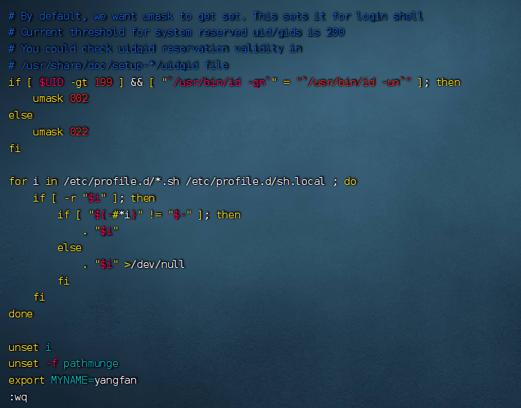

## 各类小技巧（快捷键）

### `ctrl + c`强制停止

- Linux某些程序的运行，如果想要强制停止它，可以使用快捷键`ctrl + c`

  

  扩展：`tail`命令

  

- 命令输入错误，也可以通过快捷键`ctrl + c`，退出当前输入，重新输入

  

  

### `ctrl + d`退出或登出

- 可以通过快捷键：`ctrl + d`，退出账户的登录


- 或者退出某些特定程序的专属页面


<font color=red>ps：不能用于退出vi/vim</font>


### 历史命令搜索

- 可以通过`history`命令，查看历史输入过的命令


- 可以通过：`!`命令前缀，自动执行上一次匹配前缀的命令


- 可以通过快捷键：`ctrl + r`，输入内容去匹配历史命令


如果搜索到的内容是你需要的，那么：

- 回车键可以直接执行
- 键盘左右键，可以得到此命令（不执行）


### 光标移动快捷键

- `ctrl + a`，跳到命令开头
- `ctrl + e`，跳到命令结尾
- `ctrl +键盘左键`，向左跳一个单词
- `ctrl +键盘右键`，向右跳一个单词


### 清屏

- 通过快捷键`ctrl + l`，可以清空终端内容
- 或通过命令`clear`得到同样效果


## 软件安装

操作系统安装软件有许多种方式，一般分为：

- ​	下载安装包自行安装
  - 如`win`系统使用`exe`文件、`msi`文件等
  - 如`mac`系统使用`dmg`文件、`pkg`文件等

- 系统的应用商店内安装
  - 如win系统有Microsoft Store商店
  - 如mac系统有AppStore商店


Linux系统同样支持这两种方式，我们首先，先来学习使用：Linux命令行内的”应用商店”，yum命令安装软件


### `yum`命令

`yum`：`RPM`包软件管理器，用于自动化安装配置Linux软件，并可以自动解决依赖问题。

语法：

```
yum [-y] [install | remove | search ] 软件名称 
```

- 选项：`-y`，自动确认，无需手动确认安装或卸载过程
- `install`：安装
- `remove`：卸载
- `search`：搜索

<font color=red>yum命令需要root权限哦，可以su切换到root，或使用sudo提权。yum命令需要联网</font>


- yum [-y] install wget，通过yum命令安装`wget`程序


- yum [-y] remove wget，通过yum命令卸载wget命令


- `yum search wget`，通过yum命令，搜索是否有wget安装包


## systemctl

### `systemctl`命令

Linux系统很多软件（内置或第三方）均支持使用`systemctl`命令控制：启动、停止、开机自启

能够被`systemctl`管理的软件，一般也称之为：服务

语法：

```
systemctl start | stop | status | enable | disable 服务名
```


系统内置的服务比较多，比如：

- NetworkManager，主网络服务
- network，副网络服务
- firewalld，防火墙服务
- sshd，ssh服务（`FinalShell`远程登录Linux使用的就是这个服务）

可以使用`systemctl`去尝试一下，控制这些服务的启动、关闭、自启动


### 使用`systemctl`命令控制第三方软件

除了内置的服务以外，部分第三方软件安装后也可以以`systemctl`进行控制。

- `yum install -y ntp`，安装`ntp`（第三方时间）软件


可以通过`ntpd`服务名，配合`systemctl`进行控制、


- `yum install -y httpd`，安装`apache`服务器软件


可以通过`httpd`服务名，配合`systemctl`进行控制


<font color=red>部分软件安装后没有自动集成到systemctl中，我们可以手动添加。这部分内容在后续章节和大家详细讲解。</font>


## 软连接

### `ln`命令创建软链接

在系统中创建软链接，可以将文件、文件夹链接到其它位置。

类似`Windows`系统中的《快捷方式》

语法：

```
ln -s 参数1 参数2
```

- `-s`选项，创建软连接
- 参数1：被链接的文件或文件夹
- 参数2：要链接去的目的地


实例：

- ```
  ln -s /etc/yum.conf ~/yum.conf
  ```

  

- ```
  ln -s /etc/yum ~/yum
  ```

  


## 日期、时区

### `date`命令

通过`date`命令可以在命令行中查看系统的时间

语法：

```
date [-d] [+格式化字符串]
```

- `-d`按照给定的字符串显示日期，一般用于日期计算
- 格式化字符串：通过特定的字符串标记，来控制显示的日期格式
  - `%Y`年
  - `%y`年份后两位数字(00..99)
  - `%m`月份(01..12)
  - `%d`日(01..31)
  - `%H`小时(00..23)
  - `%M`分钟(00..59)
  - `%S`秒(00..60)
  - `%s`自1970-01-01 00:00:00 UTC到现在的秒数


- 使用date命令本体，无选项，直接查看时间


可以通过格式化字符串自定义显示格式

- 按照2022-01-01的格式显示日期


- 按照2022-01-01 10:00:00的格式显示日期


由于中间带有空格，所以使用双引号包围格式化字符串，作为整体。


### 修改`Linux`时区

细心的同学可能会发现，通过`date`查看的日期时间是不准确的，这是因为：系统默认时区非中国的东八区。

<font color=red>使用root权限，执行如下命令</font>，修改时区为东八区时区


将系统自带的`localtime`文件删除，并将`/usr/share/zoneinfo/Asia/Shanghai`文件链接为`localtime`文件即可


### ntp程序

我们可以通过ntp程序自动校准系统时间

安装ntp：

```
yum -y install ntp
```

启动并设置开机自启：

- systemctl start ntpd
- systemctl enable ntpd

当`ntpd`启动后会定期的帮助我们联网校准系统的时间


- 也可以手动校准（需root权限）：

  ```
  ntpdate -u ntp.aliyun.com
  ```

  

通过阿里云提供的服务网址配合`ntpdate`（安装ntp后会附带这个命令）命令自动校准


## IP地址、主机名

### IP地址

每一台联网的电脑都会有一个地址，用于和其它计算机进行通讯

IP地址主要有2个版本，V4版本和V6版本（V6很少用，课程暂不涉及）

IPv4版本的地址格式是：a.b.c.d，其中abcd表示0~255的数字，如`192.168.88.101`就是一个标准的IP地址

可以通过命令：`ifconfig`，查看本机的ip地址，如无法使用ifconfig命令，可以安装：`yum -y install net-tools`


### 特殊IP地址

除了标准的IP地址以外，还有几个特殊的IP地址需要我们了解：

- 127.0.0.1，这个IP地址用于指代本机


- 0.0.0.0，特殊IP地址
  - 可以用于指代本机
  - 可以在端口绑定中用来确定绑定关系（后续讲解）
  - 在一些IP地址限制中，表示所有IP的意思，如放行规则设置为0.0.0.0，表示允许任意IP访问


### 主机名

每一台电脑除了对外联络地址（IP地址）以外，也可以有一个名字，称之为主机名无论是`Windows`或`Linux`系统，都可以给系统设置主机名

- Windows系统主机名


- Linux系统主机名


#### 在Linux中修改主机名

- 可以使用命令：`hostname`查看主机名


- 可以使用命令：`hostnamectl set-hostname主机名`，修改主机名（需root）


- 重新登录FinalShell即可看到主机名已经正确显示


### 域名解析

IP地址实在是难以记忆，有没有什么办法可以通过主机名或替代的字符地址去代替数字化的IP地址呢？

实际上，我们一直都是通过字符化的地址去访问服务器，很少指定IP地址

比如，我们在浏览器内打开：www.baidu.com，会打开百度的网址

其中，www.baidu.com，是百度的网址，我们称之为：域名


- 访问www.baidu.com的流程如下：


即：

- 先查看本机的记录（私人地址本）
  - Windows看：C:\Windows\System32\drivers\etc\hosts
  - Linux看：/etc/hosts

- 再联网去DNS服务器（如114.114.114.114，8.8.8.8等）询问


## 虚拟机配置固定IP

学习目标：掌握如何在VMware Workstation中配置Linux系统的固定IP地址（用于Windows系统）

### 为什么需要固定`IP`

当前我们虚拟机的Linux操作系统，其IP地址是通过DHCP服务获取的。

DHCP：动态获取IP地址，即每次重启设备后都会获取一次，可能导致`IP`地址频繁变更

- `原因1`：办公电脑IP地址变化无所谓，但是我们要远程连接到Linux系统，如果IP地址经常变化我们就要频繁修改适配很麻烦
- `原因2`：配置了虚拟机IP地址和主机名的映射，如果IP频繁更改，我们也需要频繁更新映射关系

### 在VMware Workstation中配置固定`IP`

​		配置固定IP需要2个大步骤：

- 在VMware Workstation（或Fusion）中配置IP地址网关和网段（IP地址的范围）


1. 子网`ip`设置为：`192.168.88.0`
2. 子网掩码：`255.255.255.0`
3. 点击`NAT设置`
4. 要求网管`IP`设置为`192.168.88.2`

   

- 在Linux系统中手动修改配置文件，固定`IP`

  1. 使用vim编辑/etc/sysconfig/network-scripts/ifcfg-ens33文件，填入如下内容

     

     2.执行：`systemctl restart network`重启网卡，执行ifconfig即可看到ip地址固定为`192.168.88.130`了

  

  

## 网络传输

学习目标

1. 掌握使用ping命令检查服务器是否可联通
2. 掌握使用wget命令下载文件
3. 掌握使用curl命令发起网络请求

### 下载和网络请求

#### `ping`命令

可以通过ping命令，检查指定的网络服务器是否是可联通状态

语法：

```
ping [-c num] ip或主机名
```

- 选项：`-c`，检查的次数，不使用`-c`选项，将无限次数持续检查
- 参数：`ip`或`主机名`，被检查的服务器的`ip`地址或主机名地址

示例：

- 检查到`baidu.com`是否联通


结果表示联通，延迟`30ms`左右

- 检查到`39.156.66.10`是否联通，并检查`3`次


- 检查一个无法访问的`ip`地址


#### `wget`命令

`wget`是非交互式的文件下载器，可以在命令行内下载网络文件

语法：

```
wget [-b] url
```

- 选项：`-b`，可选，后台下载，会将日志写入到当前工作目录的`wget-log`文件
- 参数：`url`，下载链接

示例：

- 下载`apache-hadoop` 3.3.0版本：`wget http://archive.apache.org/dist/hadoop/common/hadoop-3.3.0/hadoop-3.3.0.tar.gz`

  

- 在后台下载：`wget -b http://archive.apache.org/dist/hadoop/common/hadoop-3.3.0/hadoop-3.3.0.tar.gz`

- 通过tail命令可以监控后台下载进度：`tail -f wget-log`


<font color=red>注意：无论下载是否完成，都会生成要下载的文件，如果下载未完成，请及时清理未完成的不可用文件。</font>


#### `curl`命令

`curl`可以发送`http`网络请求，可用于：下载文件、获取信息等

语法：

```
curl [-O] url
```

- 选项：`-O`，用于下载文件，当`url`是下载链接时，可以使用此选项保存文件
- 参数：`url`，要发起请求的网络地址


示例：

- 向`cip.cc`发起网络请求：`curl cip.cc`


- 向`xajkit.com`发起网络请求：`curl xajkit.com`


- 通过`curl`下载`hadoop-3.3.0`安装包：`curl -O http://archive.apache.org/dist/hadoop/common/hadoop3.3.0/hadoop-3.3.0.tar.gz`


### 端口

学习目标

1. 掌握端口的概念

2. 掌握`netstat`命令的基本使用

   

   

端口，是设备与外界通讯交流的出入口。端口可以分为：物理端口和虚拟端口两类

- 物理端口：又可称之为接口，是可见的端口，如`USB接口`，`RJ45网口`，`HDMI`端口等
- 虚拟端口：是指计算机内部的端口，是不可见的，是用来操作系统和外部进行交互使用的


#### 端口（虚拟）

物理端口我们日常生活中经常见到，也能知晓它的作用。

但是虚拟端口，有什么用？为什么需要它呢？


计算机程序之间的通讯，通过`IP`只能锁定计算机，但是无法锁定具体的程序。

通过端口可以锁定计算机上具体的程序，确保程序之间进行沟通

<font color=red>IP地址相当于小区地址，在小区内可以有许多住户（程序），而门牌号（端口）就是各个住户（程序）的联系</font>


Linux系统是一个超大号小区，可以支持65535个端口，这6万多个端口分为3类进行使用：

- 公认端口：`1~1023`，通常用于一些系统内置或知名程序的预留使用，如SSH服务的22端口，HTTPS服务的443端口			(非特殊需要，不要占用这个范围的端口)
- 注册端口：`1024~49151`，通常可以随意使用，用于松散的绑定一些程序/服务

- 动态端口：`49152~65535`，通常不会固定绑定程序，而是当程序对外进行网络链接时，用于临时使用。


如图中，计算机A的微信连接计算机B的微信，A使用的50001即动态端口，临时找一个端口作为出口

计算机B的微信使用端口5678，即注册端口，长期绑定此端口等待别人连接


#### 查看端口占用

可以通过Linux命令去查看端口的占用情况


##### `nmap`

- 使用`nmap`命令，安装`nmap`

  ```
  yum -y install nmap
  ```

语法：

```
nmap 被查看的IP地址
```


可以看到，本机（127.0.0.1）上有5个端口现在被程序占用了。

其中：

- 22端口，一般是`SSH`服务使用，即`FinalShell`远程连接Linux所使用的端口

  


##### `netstat`

可以通过`netstat`命令，查看指定端口的占用情况

语法：

```
netstat -anp | grep 端口号
```


安装`netstat`：

```
yum -y install net-tools
```


如图，可以看到当前系统6000端口被程序（进程号7284）占用了

其中，`0.0.0.0:6000`，表示端口绑定在`0.0.0.0`这个`IP`地址上，表示允许外部访问


可以看到，当前系统12345端口，无人使用。


## 进程管理

### 进程

程序运行在操作系统中，是被操作系统所管理的。

为管理运行的程序，每一个程序在运行的时候，便被操作系统注册为系统中的一个：进程

并会为每一个进程都分配一个独有的：进程ID（进程号）


<font color=red>**Windows系统任务管理器**</font>


<font color=red>**Linux系统查看进程**</font>


### 查看进程

可以通过`ps`命令查看`Linux`系统中的进程信息

语法：

```
ps [-e -f]
```

选项：`-e`，显示出全部的进程

选项：`-f`，以完全格式化的形式展示信息（展示全部信息）

固定用法就是：`ps -ef`列出全部进程的全部信息


### 查看指定进程

- 在`FinalShell`中，执行命令：`tail`，可以看到，此命令一直阻塞在那里
- 在`FinalShell`中，复制一个标签页，执行：`ps -ef`找出`tail`这个程序的进程信息
- 问题：是否会发现，列出的信息太多，无法准确的找到或很麻烦怎么办？


我们可以使用管道符配合grep来进行过滤，如：

```
ps -ef | grep tail，即可准确的找到tail命令的信息
```


- 过滤不仅仅过滤名称，进程号，用户ID等等，都可以被grep过滤哦


- 如：`ps -ef | grep 30001`，过滤带有30001关键字的进程信息（一般指代过滤30001进程号）


### 关闭进程

在`Windows`系统中，可以通过任务管理器选择进程后，点击结束进程从而关闭它。

同样，在`Linux`中，可以通过`kill`命令关闭进程。

语法：

```
kill [-9] 进程ID
```

选项：`-9`，表示强制关闭进程。不使用此选项会向进程发送信号要求其关闭，但是否关闭看进程自身的处理机制。


## 主机状态

学习目标

1. 掌握查看主机运行状态的监控命令


### 查看系统资源占用

- 可以通过top命令查看CPU、内存使用情况，类似Windows的任务管理器

  ​		默认<font color=red>每5秒刷新</font>一次，语法：

  ```
  top
  ```

  <font color=red>按**q**或**ctrl + c**退出</font>


- 第一行：

top：命令名称，

14:39:58：当前系统时间，

up 6 min：启动了6分钟

2 users：2个用户登录，

load：1、5、15分钟负载

- 第二行：


Tasks：175个进程，

1 running：1个进程子在运行，

174 sleeping：174个进程睡眠，

0个停止进程，

0个僵尸进程

- 第三行：


%Cpu(s)：CPU使用率，

us：用户CPU使用率，

sy：系统CPU使用率，

ni：高优先级进程占用CPU时间百分比，

id：空闲CPU率，

wa：IO等待CPU占用率，

hi：CPU硬件中断率，

si：CPU软件中断率，

st：强制等待占用CPU率

- 第四、五行：


Kib Mem：物理内存，

total：总量，

free：空闲，

used：使用，

buf/cache：buf和cache占用

KibSwap：虚拟内存（交换空间），

total：总量，

free：空闲，

used：使用，

buf/cache：buf和cache占用


- PID：进程`id`

- USER：进程所属用户

- PR：进程优先级，越小越高

- NI：负值表示高优先级，正表示低优先级

- VIRT：进程使用虚拟内存，单位KB

- RES：进程使用物理内存，单位KB

- SHR：进程使用共享内存，单位KB

- S：进程状态（S休眠，R运行，Z僵死状态，N负数优先级，I空闲状态）

- %CPU：进程占用CPU率

- %MEM：进程占用内存率

- TIME+：进程使用CPU时间总计，单位10毫秒

- COMMAND：进程的命令或名称或程序文件路径

  

### top命令选项


### top交互式选项

当top以交互式运行（非-b选项启动），可以用以下交互式命令进行控制


### 磁盘信息监控

#### `df`命令，可以查看硬盘的使用情况

语法：

```
df [-h]
```

选项：`-h`，以更加人性化的单位显示


#### `iostat`查看CPU、磁盘的相关信息

语法：

```
iostat [-x] [num1] [num2]
```


- 选项：`-x`，显示更多信息


**tps**：该设备每秒的传输次数（Indicate the number of transfers per second that were issued to thedevice.）。"一次传输"意思是"一次I/O请求"。多个逻辑请求可能会被合并为"一次I/O请求"。"一次传输"请求的大小是未知的。


- num1：数字，刷新间隔，num2：数字，刷新几次


### `sar`网络状态监控

- 可以使用`sar`命令查看网络的相关统计（`sar`命令非常复杂，这里仅简单用于统计网络）

语法：

```
sar -n DEV num1 num2
```

选项：-n，查看网络，DEV表示查看网络接口

num1：刷新间隔（不填就查看一次结束），num2：查看次数（不填无限次数）


信息解读：

- IFACE本地网卡接口的名称
- rxpck/s每秒钟接受的数据包
- txpck/s每秒钟发送的数据包
- rxKB/S每秒钟接受的数据包大小，单位为KB
- txKB/S每秒钟发送的数据包大小，单位为KB
- rxcmp/s每秒钟接受的压缩数据包
- txcmp/s每秒钟发送的压缩包
- rxmcst/s每秒钟接收的多播数据包


## 环境变量

学习目标

1. 理解环境变量的作用

2. 掌握符号$的作用

3. 掌握在Linux中配置

   

### 环境变量

在讲解`which`命令的时候，我们知道使用的一系列命令其实本质上就是一个个的可执行程序。

比如，cd命令的本体就是：`/usr/bin/cd`这个程序文件。


我们是否会有疑问，为何无论当前工作目录在哪里，都能执行：/usr/bin/cd这个程序呢？

这就是环境变量的作用啦。


环境变量是操作系统（Windows、Linux、Mac）在运行的时候，记录的一些关键性信息，用以辅助系统运行。

在Linux系统中执行：`env`命令即可查看当前系统中记录的环境变量

环境变量是一种`KeyValue`型结构，即名称和值，如下图：


### 环境变量：`PATH`

在前面提出的问题中，我们说无论当前工作目录是什么，都能执行/usr/bin/cd这个程序，这个就是借助环境变量中：

`PATH`这个项目的值来做到的。


PATH记录了系统执行任何命令的搜索路径，如上图记录了(路径之间以`:`隔开)

- /usr/local/bin
- /usr/bin
- /usr/local/sbin
- /usr/sbin


当执行任何命令，都会按照顺序，从上述路径中搜索要执行的程序的本体

比如执行`cd`命令，就从第二个目录`/usr/bin`中搜索到了`cd`命令，并执行


### $符号

在Linux系统中，`$`符号被用于取”变量”的值。环境变量记录的信息，除了给操作系统自己使用外，如果我们想要取用，也可以使用。

比如：`echo $PATH`

就可以取得PATH这个环境变量的值，并通过`echo`语句输出出来。


又或者：`echo ${PATH}ABC`


当和其它内容混合在一起的时候，可以通过`{}`来标注取的变量是谁


### 自行设置环境变量

Linux环境变量可以用户自行设置，其中分为：

- 临时设置，语法：

  ```
  export 变量名=变量值
  ```

  

- 永久生效

  - 针对当前用户生效，配置在当前用户的：`~/.bashrc`文件中

    

    

  - 针对所有用户生效，配置在系统的：`/etc/profile`文件中

    

    

  - 并通过语法：`source`配置文件，进行立刻生效，或重新登录`FinalShell`生效

    

## 上传、下载

我们可以通过`FinalShell`工具，方便的和虚拟机进行数据交换。

在`FinalShell`软件的下方窗体中，提供了`Linux`的文件系统视图，可以方便的：

- 浏览文件系统，找到合适的文件，右键点击下载，即可传输到本地电脑
- 浏览文件系统，找到合适的目录，将本地电脑的文件拓展进入，即可方便的上传数据到`Linux`中


### `rz`、`sz`命令

当然，除了通过`FinalShell`的下方窗体进行文件的传输以外，也可以通过`rz`、`sz`命令进行文件传输。

`rz`、`sz`命令需要安装，可以通过：`yum -y install lrzsz`，即可安装。


- `rz`命令，进行上传，语法：

  ```
  rz
  ```

  

- sz命令进行下载，语法：

  ```
  sz 要下载的文件
  ```

  

文件会自动下载到桌面的：`fsdownload`文件夹中。

<font color=red>注意，rz、sz命令需要终端软件支持才可正常运行**FinalShell**、**SecureCRT**、**XShell**等常用终端软件均支持此操作</font>


## 压缩、解压

学习目标

1. 掌握使用tar命令压缩或解压tar或gzip文件

2. 掌握使用zip、unzip命令压缩或解压zip文件

   


### 压缩格式

市面上有非常多的压缩格式

- zip格式：Linux、Windows、MacOS，常用
- 7zip：Windows系统常用
- rar：Windows系统常用
- tar：Linux、MacOS常用
- gzip：Linux、MacOS常用

在Windows系统中常用的软件如：winrar、bandizip等软件，都支持各类常见的压缩格式。

我们现在要学习，如何在Linux系统中操作：tar、gzip、zip这三种压缩格式完成文件的压缩、解压操作。


### `tar`命令

Linux和Mac系统常用有2种压缩格式，后缀名分别是：

- `.tar`，称之为`tarball`，归档文件，即简单的将文件组装到一个.tar的文件内，并没有太多文件体积的减少，仅仅是简单的封装
- `.gz`，也常见为.tar.gz，gzip格式压缩文件，即使用gzip压缩算法将文件压缩到一个文件内，可以极大的减少压缩后的体积

针对这两种格式，使用tar命令均可以进行压缩和解压缩的操作。

语法：

```
tar [-c -v -x -f -z -C] 参数1 参数2 ... 参数N
```

- `-c`，创建压缩文件，用于压缩模式

- `-v`，显示压缩、解压过程，用于查看进度

- `-x`，解压模式

- `-f`，要创建的文件，或要解压的文件，`-f`选项必须在所有选项中位置处于**最后一个**

- `-z`，`gzip`模式，不使用`-z`就是普通的`tarball`格式

- `-C`，选择解压的目的地，用于解压模式

  

### `tar`命令压缩

- ```
  tar -cvf test.tar 1.txt 2.txt 3.txt
  ```

  将`1.txt 2.txt 3.txt`压缩到`test.tar`文件内

- ```
  tar -zcvf test.tar.gz 1.txt 2.txt 3.txt
  ```

  将`1.txt 2.txt 3.txt`压缩到`test.tar.gz`文件内，使用`gzip`模式

注意：

- `-z`选项如果使用的话，一般处于选项位第一个

- `-f`选项，<font color=red>必须</font>在选项位最后一个

  


### `tar`解压

常用的`tar`解压组合有以下：


```
tar -xvf test.tar
```

解压`test.tar`，将文件解压至当前目录

```
tar -xvf test.tar -C /home/yangfan
```

解压`test.tar`，将文件解压至指定目录（`/home/yangfan`）

```
tar -zxvf test.tar.gz -C /home/yangfan
```

以`Gzip`模式解压`test.tar.gz`，将文件解压至指定目录（`/home/yangfan`）


注意：

- `-f`选项，必须在选项组合体的最后一位

- `-z`选项，建议在开头位置

- `-C`选项单独使用，和解压所需的其它参数分开

  
  
  


### `zip`命令压缩文件

可以使用`zip`命令，压缩文件为`zip`压缩包

语法：

```
zip [-r] 参数1 参数2 ... 参数N
```

- `-r`，被压缩的包含文件夹的时候，需要使用`-r`选项，和`rm`、`cp`等命令的`-r`效果一致


示例：

- ```
  zip test.zip a.txt b.txt c.txt
  ```

  将`a.txt b.txt c.txt`压缩到`test.zip`文件内

- ```
  zip -r test.zip test yangfan a.txt
  ```

  将`test`、`yangfan`两个文件夹和`a.tx`t文件，压缩到`test.zip`文件内

  

### `unzip`命令解压文件

使用`unzip`命令，可以方便的解压`zip`压缩包

语法：

```
unzip [-d] 参数
```

- `-d`，指定要解压去的位置，同`tar`的`-C`选项
- 参数，被解压的`zip`压缩包文件


示例：

- `unzip test.zip`，将test.zip解压到当前目录
- `unzip test.zip -d /home/yangfan`，将`test.zip`解压到指定文件夹内（/home/yangfan）

