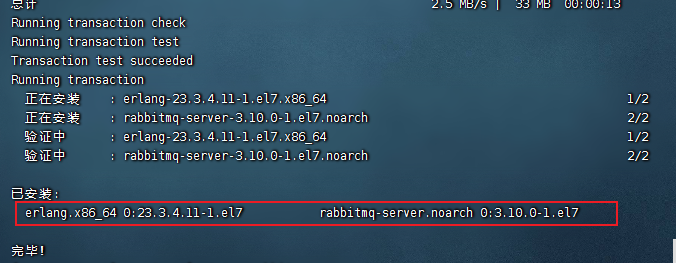

## 前言

### 为什么学习各类软件在`Linux`上的部署

​		在前面，我们学习了许多的`Linux`命令和高级技巧，这些知识点比较零散，同学们跟随着课程的内容进行练习虽然可以基础掌握这些命令和技巧的使用，但是并没有一些具体的实操能够串联起来这些知识点。

​		所以，现在我们设计了各类软件在Linux上部署安装的实战章节，可以让同学们：

- 对前面学习的各类操作命令进行复习和练习，从而深度掌握它们
- 本章节中演示部署的软件，包含了`IT`行业各类岗位中所必须使用的，如：`Java后台`、`大数据开发`、`运维开发`、`测试`、`AI`等。无论学习`Linux`后从事什么岗位，这些内容都会给你带来帮助

> 对于零基础学员，实战课程中所讲解的软件大概率多数大家并不了解。
> 所以，课程仅涉及到安装部署，不对软件的使用做详细说明。
> 同学们在这个过程中，可能会遇到各种各样的错误，不要怕，解决它，将会给你带来极大的提升。


### 前置要求

1. 实战章节要求同学们务必全部学习前面的知识点，即：初识Linux、`Linux基础命令`、`Linux权限管理`、Linux高阶技巧这4个章节，请勿跳过前面的章节学习实战章节。


### 注意

下面全部的软件安装的相关流程，90%都是取自软件自身的官方网站。

一个合格的程序员要有良好的信息收集能力


## MySQL数据库管理系统安装部署【简单】

### 简介

​		`MySQL`数据库管理系统（后续简称MySQL），是一款知名的数据库系统，其特点是：轻量、简单、功能丰富。

​		`MySQL`数据库可谓是软件行业的明星产品，无论是后端开发、大数据、AI、运维、测试等各类岗位，基本上都会和`MySQL`打交道。

​		让我们从`MySQL`开始，进行实战的`Linux`软件安装部署。

​		本次课程分为2个版本进行安装：

- `MySQL5.7`版本安装
- `MySQL8.x`版本安装

> 由于`MySQL5.x`和`8.x`各自有许多使用者，所以这两个版本我们都演示安装一遍


### 注意

​		`MySQL`的安装过程中，除了会使用`Linux`命令外，还会使用到少量的数据库专用的：`SQL`语句

​		对于`SQL`语句我们并未涉及，所以可以跟随教程的内容，复制粘贴即可

> 如有时间，建议可以在学习完Linux系统之后，学习一下`MySQL`数据库
>
> 无论从事什么方面的开发，Java后端、大数据、AI、前端、Linux运维等，都会要求掌握MySQL数据库的
>
> 可以说，`MySQL`是IT开发从业者必备的技能了。


### `MySQL`5.7版本在`CentOS`系统安装

> 注意：安装操作需要`root`权限

`MySQL`的安装我们可以通过前面学习的`yum`命令进行。


#### 安装

##### 配置`yum`仓库

```
# 	更新密钥
rpm --import https://repo.mysql.com/RPM-GPG-KEY-mysql-2022

#	安装 Mysqlyum 库

rpm -Uvh http://repo.mysql.com/mysql57-community-release-el7-7.noarch.rpm
```


> 由于MySQL并不在CentOS的官方仓库中，所以我们通过上述rpm命令：
>
> - 导入MySQL仓库的密钥
> - 配置MySQL的yum仓库


##### 使用`yum`安装`MySQL`

```
#	yum安装Mysql
yum -y install mysql-community-server
```


##### 安装完成后，启动`MySQL`并配置开机自启动

```
systemctl start mysqld		#启动

systemctl enable mysqld		#开机自启
```

> MySQL安装完成后，会自动配置为名称叫做：`mysqld`的服务，可以被`systemctl`所管理


##### 检查`MySQL`的运行状态

```
systemctl status mysqld
```


#### 配置

主要配置管理员用户`root`的**密码**以及配置**允许远程登录**的权限。

##### 获取`MySQL`的初始密码

```
#通过grep命令，在/var/log/mysqld.log文件中，过滤temporarypassword关键字，得到初始密码
grep 'temporary password' /var/log/mysqld.log
```


##### 登陆`MySQL`数据库系统

```
# 执行
mysql -uroot -p
# 解释
# -u，登陆的用户，MySQL数据库的管理员用户同Linux一样，是root
# -p，表示使用密码登陆
# 执行完毕后输入刚刚得到的初始密码，即可进入MySQL数据库
```


##### 修改`root`用户密码

```
#在MySQL控制台内执行
ALTER USER 'root'@'localhost' IDENTIFIED BY '密码';
```


##### [扩展]，配置`root`的简单密码

> 我们可以给root设置简单密码，如123456
>
> 请注意，此配置仅仅是用于测试环境或学习环境的MySQL，如果是正式使用，请勿设置简单密码

```
#如果你想设置简单密码，需要降低Mysql的密码安全级别

set global validate_password_policy=LOW; #密码安全级别低

set global validate_password_length=4; #密码长度最低4位即可

#然后就可以用简单密码了（课程中使用简单密码，为了方便，生产中不要这样）

ALTER USER 'root'@'localhost' IDENTIFIED BY '简单密码';
```


##### [扩展]，配置`root`运行远程登录

> 默认情况下，`root`用户是不运行远程登录的，只允许在`MySQL`所在的`Linux`服务器登陆`MySQL`系统
>
> 请注意，允许`root`远程登录会带来安全风险


```
# 授权root远程登录
grant all privileges on *.* to root@"IP地址" identified by '密码' with grant option;
# IP地址即允许登陆的IP地址，也可以填写%，表示允许任何地址
# 密码表示给远程登录独立设置密码，和本地登陆的密码可以不同
# 刷新权限，生效
flush privileges;
```


##### 退出`MySQL`控制台页面

```
# 退出命令
exit

# 或者通过快捷键：ctrl+d
```


##### 检查端口

`MySQL`默认绑定了`3306`端口，可以通过端口占用检查`MySQL`的网络状态

```
netstat -anp | grep 3306
```


至此，`MySQL`就安装完成并可用了，请妥善保存好`MySQL`的`root`密码。


### `MySQL`8.0版本在`CentOS`系统安装

> 注意：安装操作需要`root`权限


#### 安装

##### 配置yum仓库

```
# 更新密钥
rpm --import https://repo.mysql.com/RPM-GPG-KEY-mysql-2022

# 安装Mysql8.x版本yum库
rpm -Uvh https://dev.mysql.com/get/mysql80-community-release-el7-2.noarch.rpm

```


##### 使用`yum`安装`MySQL`

```
# yum安装Mysql

yum -y install mysql-community-server
```


##### 安装完成后，启动`MySQL`并配置开机自启动

```
systemctl start mysqld		#启动

systemctl enable mysqld		#开机自启
```

> MySQL安装完成后，会自动配置为名称叫做：mysqld的服务，可以被systemctl所管理


##### 检查`MySQL`的运行状态

```
systemctl status mysqld
```


#### 配置

主要修改root密码和允许root远程登录


##### 获取`MySQL`的初始密码

```
#
通过grep命令，在/var/log/mysqld.log文件中，过滤temporarypassword关键字，得到初始密码
grep 'temporary password' /var/log/mysqld.log
```


##### 登录`MySQL`数据库系统

```
# 执行
mysql -uroot -p
# 解释
# -u，登陆的用户，MySQL数据库的管理员用户同Linux一样，是root

# -p，表示使用密码登陆

# 执行完毕后输入刚刚得到的初始密码，即可进入MySQL数据库
```


##### 修改`root`密码

```
ALTER USER 'root'@'localhost' IDENTIFIED WITH mysql_native_password BY '密码';

--密码需要符合：大于8位，有大写字母，有特殊符号，不能是连续的简单语句如123，abc
```


##### [扩展]，配置`root`的简单密码

> 我们可以给root设置简单密码，如123456
>
> 请注意，此配置仅仅是用于测试环境或学习环境的MySQL，如果是正式使用，请勿设置简单密码

```
set global validate_password.policy=0;	#密码安全级别低
set global validate_password.length=4;	#密码长度最低4位即可
```


##### 允许`root`远程登录，并设置远程登录密码

> 默认情况下，root用户是不运行远程登录的，只允许在MySQL所在的Linux服务器登陆MySQL系统
>
> 请注意，允许root远程登录会带来安全风险

```
# 第一次设置root远程登录，并配置远程密码使用如下SQL命令
create user 'root'@'%' IDENTIFIED WITH mysql_native_password BY '密码!';

--密码需要符合：大于8位，有大写字母，有特殊符号，不能是连续的简单语句如123，abc

# 后续修改密码使用如下SQL命令
ALTER USER 'root'@'%'IDENTIFIED WITH mysql_native_password BY '密码';

```


##### 退出MySQL控制台页面

```
# 退出命令
exit
# 或者通过快捷键退出：ctrl+d
```


##### 检查端口

MySQL默认绑定了3306端口，可以通过端口占用检查MySQL的网络状态

```
netstat -anp | grep 3306
```

至此，MySQL就安装完成并可用了，请妥善保存好MySQL的root密码。


## Tomcat安装部署【简单】

### 简介

​		Tomcat是由Apache开发的一个Servlet容器，实现了对Servlet和JSP的支持，并提供了作为Web服务器的一些特有功能，如Tomcat管理和控制平台、安全域管理和Tomcat阀等。

​		简单来说，Tomcat是一个WEB应用程序的托管平台，可以让用户编写的WEB应用程序，被Tomcat所托管，并提供网站服务。

> 即让用户开发的WEB应用程序，变成可以被访问的网页。


### 安装

Tomcat的安装非常简单，主要分为2部分：

1. 安装JDK环境
2. 解压并安装Tomcat

> 本次安装使用Tomcat版本是：10.0.27版本，需要Java（JDK）版本最低为JDK8或更高版本
>
> 课程中使用的JDK版本是：JDK8u351版本


### 安装JDK环境

#### 下载JDK软件

https:/www.oracle.com/java/technologies/downloads

在页面下方找到：


下载`jdk-8u351-linux-x64.tar.gz`


在弹出的页面中输入`Oracle`的账户密码即可下载（如无账户，请自行注册，注册是免费的）


#### 登陆`Linux`系统，切换到`root`用户

#### 通过`FinalShell`，上传下载好的`JDK`安装包，上传到根目录的`root`文件夹底下

1. 需要从`FinalShell`软件重新登录`root`用户，才可以进行读取。

#### 创建文件夹，用来部署`JDK`，将`JDK`和`Tomcat`都安装部署到：`/export/server`内

```
mkdir -p /export/server
```


#### 解压缩`JDK`安装文件

```
tar -zxvf jdk-8u371-linux-x64.tar.gz -C /export/server
```


#### 配置JDK的软链接

```
ln -s /export/server/jdk1.8.0_371 /export/server/jdk
```


#### 配置`JAVA_HOME`环境变量，以及将`$JAVA_HOME/bin`文件夹加入`PATH`环境变量中

```
# 编辑 /etc/profile 文件
export JAVA_HOME=/export/server/jdk
export PATH=$PATH:$JAVA_HOME/bin
```


#### 生效环境变量

```
source /etc/profile
```


#### 配置`java`执行程序的软链接

```
# 删除系统自带的java程序
rm -f /usr/bin/java
# 软链接我们自己安装的java程序
ln -s /export/server/jdk/bin/java /usr/bin/java
```


#### 执行验证：

```
java -version
javac -version
```


### 解压并部署`Tomcat`

> Tomcat建议使用非Root用户安装并启动
>
> 可以创建一个用户：tomcat用以部署

#### 首先，放行`tomcat`需要使用的`8080`端口的外部访问权限

> CentOS系统默认开启了防火墙，阻止外部网络流量访问系统内部
>
> 所以，如果想要Tomcat可以正常使用，需要对Tomcat默认使用的8080端口进行放行
>
> 放行有2种操作方式：
>
> 1. 关闭防火墙
> 2. 配置防火墙规则，放行端口

```
# 以下操作2选一即可
# 方式1：关闭防火墙
systemctl stop firewalld  #关闭防火墙
systemctl disable firewalld #停止防火墙开机自启

# 方式2：放行8080端口的外部访问
firewall-cmd --add-port=8080/tcp -permanent
# -add-port=8080/tcp 表示放行8080端口的tcp访问，--permanent表示永久生效
firewal-cmd --reload
# 重新载入防火墙规则使其生效
```

> 方便起见，建议同学们选择方式1，直接关闭防火墙一劳永逸
>
> 防火墙的配置非常复杂，后面会视情况独立出一集防火墙配置规则的章节。


#### 以`root`用户操作，创建`tomcat`用户

```
# 使用root用户操作
useradd tomcat
# 可选，为tomcat用户配置密码
passwd tomcat
```


#### 下载`Tomcat`安装包

```
# 使用root用户操作
wget https://dlcdn.apache.org/tomcat/tomcat-8/v8.5.88/bin/apache-tomcat-8.5.88.tar.gz

# 如果出现https相关错误，可以使用--no-check-certificate选项
wget --no-check-certificate https://dlcdn.apache.org/tomcat/tomcat-8/v8.5.88/bin/apache-tomcat-8.5.88.tar.gz
```

> 如果Linux内下载过慢，可以复制下载链接在Windows系统中使用迅雷等软件加速下载然后上传到Linux内即可
>
> 或者使用课程资料中提供的安装包


#### 解压`Tomcat`安装包

```
# 使用root用户操作，否则无权限解压到/export/server内，除非修改此文件夹权限
tar -zxvf apache-tomcat-8.5.88.tar.gz -C /export/server
```


#### 创建`Tomcat`软链接

```
# 使用root用户操作
ln -s /export/server/apache-tomcat-8.5.88 /export/server/tomcat
```


#### 修改`tomcat`安装目录权限

```
# 使用root用户操作，同时对软链接和tomcat安装文件夹进行修改，使用通配符*进行匹配
chown -R tomcat:tomcat /export/server *tomcat*
```


#### 切换到`tomcat`用户

```
su - tomcat
```


#### 启动`tomcat`

```
/export/server/tomcat/bin/startup.sh
```


#### `tomcat`启动在`8080`端口，可以检查是否正常启动成功

```
netstat -anp | grep 8080
```


#### 打开浏览器，输入：

`http:/centos:8080`或`http:/192.168.88.130:8080`

使用主机名（需配置好本地的主机名映射）或`IP`地址访问`Tomcat`的WEB页面


##### 但是无法访问，此时需要配置防火墙。

```
curl 127.0.0.1:8080
```


内部可以访问，外部无法访问。需要阅读`3.4.1章节`关闭防火墙

当关闭防火墙后，访问`http:/centos:8080`或`http:/192.168.88.130:8080`便可以打开`tomcat`网址。

至此，`Tomcat`安装配置完成。


## Nginx安装部署【简单】

### 简介

Nginx(enginex)是一个高性能的`HTTP`和反向代理`web服务器`，同时也提供了IMAP/POP3/SMTP服务。

同Tomcat一样，Nginx可以托管用户编写的WEB应用程序成为可访问的网页服务，同时也可以作为流量代理服务器，控制流量的中转。

Nginx在WEB开发领域，基本上也是必备组件之一了。


### 安装

Nginx同样需要配置额外的yum仓库，才可以使用yum安装

> 安装Nginx的操作需要root身份

#### 安装`yum`依赖程序

```
# root执行
yum install -y yum-utils
```


#### 手动添加，nginx的yum仓库

yum程序使用的仓库配置文件，存放在：`/etc/yum.repos.d`内。


```
# root执行
# 创建文件使用vim
vim /etc/yum.repos.d/nginx.repo
# 填入如下内容并保存退出
[nginx-stable]
name=nginx stable repo
baseurl=http://nginx.org/packages/centos/$releasever/$basearch/
gpgcheck=1
enabled=1
gpgkey=https://nginx.org/keys/nginx_signing.key
module_hotfixes=true

[nginx-mainline]
name=nginx mainline repo
baseurl=http://nginx.org/packages/mainline/centos/$releasever/$basearch/
gpgcheck=1
enabled=0
gpgkey=https://nginx.org/keys/nginx_signing.key
module_hotfixes=true
```

> 通过如上操作，我们手动添加了nginx的yum仓库


#### 通过yum安装最新稳定版的nginx

```
# root执行
yum install -y nginx
```


#### 启动

```
# nginx自动注册了systemctl系统服务
systemctl start nginx	#启动
systemctl stop nginx #停止
systemctl status nginx #运行状态
systemctl enable nginx	#开机自启
systemctl disable nginx #关闭开机自启
```


#### 配置防火墙放行

nginx默认绑定80端口，需要关闭防火墙或放行80端口

```
# 方式1（推荐），关闭防火墙
systemctl stop firewalld  # 关闭
systemctl disable firewalld #关闭开机自启

# 方式2，放行80端口
firewall-cmd --add-port=88/tcp --premanent	#放行tcp规则下的80端口，永久生效
firewall-cmd --reload #重新加载防火墙规则
```


#### 启动后浏览器输入Linux服务器的IP地址或主机名即可访问

查看端口80端口

```
netstat -anp | grep 80
```


`http:/192.168.88.130`或`http:/centos`

> ps：80端口是访问网站的默认端口，所以后面无需跟随端口号
>
> 显示的指定端口也是可以的比如：
>
> http:/192.168.88.130:80
>
> http:/centos:80


至此，Nginx安装配置完成。


## RabbitMQ安装部署【简单】

### 简介

RabbitMQ一款知名的开源消息队列系统，为企业提供消息的发布、订阅、点对点传输等消息服务。

RabbitMQ在企业开发中十分常见，课程为大家演示快速搭建RabbitMQ环境。


### 安装

> rabbitmq在yum仓库中的版本比较老，所以我们需要手动构建yum仓库


#### 1.准备yum仓库

```
# root执行
# 1. 准备gpgkey密钥
rpm --import https://github.com/rabbitmq/signing-keys/releases/download/2.0/rabbitmq-release-signing-key.asc

rpm --import https://packagecloud.io/rabbitmq/erlang/gpgkey

rpm --import https://packagecloud.io/rabbitmq/rabbitmq-server/gpgkey

# 2. 准备仓库文件
vim /etc/yum.repos.d/rabbitmq.repo
# 填入如下内容
##
## Zero dependency Erlang
##

[rabbitmq_erlang]
name=rabbitmq_erlang
baseurl=https://packagecloud.io/rabbitmq/erlang/el/7/$basearch
repo_gpgcheck=1
gpgcheck=1
enabled=1
# PackageCloud's repository key and RabbitMQ package signing key
gpgkey=https://packagecloud.io/rabbitmq/erlang/gpgkey
       https://github.com/rabbitmq/signing-keys/releases/download/2.0/rabbitmq-release-signing-key.asc
sslverify=1
sslcacert=/etc/pki/tls/certs/ca-bundle.crt
metadata_expire=300

[rabbitmq_erlang-source]
name=rabbitmq_erlang-source
baseurl=https://packagecloud.io/rabbitmq/erlang/el/7/SRPMS
repo_gpgcheck=1
gpgcheck=0
enabled=1
# PackageCloud's repository key and RabbitMQ package signing key
gpgkey=https://packagecloud.io/rabbitmq/erlang/gpgkey
       https://github.com/rabbitmq/signing-keys/releases/download/2.0/rabbitmq-release-signing-key.asc
sslverify=1
sslcacert=/etc/pki/tls/certs/ca-bundle.crt
metadata_expire=300

##
## RabbitMQ server
##

[rabbitmq_server]
name=rabbitmq_server
baseurl=https://packagecloud.io/rabbitmq/rabbitmq-server/el/7/$basearch
repo_gpgcheck=1
gpgcheck=0
enabled=1
# PackageCloud's repository key and RabbitMQ package signing key
gpgkey=https://packagecloud.io/rabbitmq/rabbitmq-server/gpgkey
       https://github.com/rabbitmq/signing-keys/releases/download/2.0/rabbitmq-release-signing-key.asc
sslverify=1
sslcacert=/etc/pki/tls/certs/ca-bundle.crt
metadata_expire=300

[rabbitmq_server-source]
name=rabbitmq_server-source
baseurl=https://packagecloud.io/rabbitmq/rabbitmq-server/el/7/SRPMS
repo_gpgcheck=1
gpgcheck=0
enabled=1
gpgkey=https://packagecloud.io/rabbitmq/rabbitmq-server/gpgkey
sslverify=1
sslcacert=/etc/pki/tls/certs/ca-bundle.crt
metadata_expire=300
```


#### 安装RabbitMQ

```
# root执行
yum install -y erlang rabbitmq-server 
```


```
Installed:
  erlang.x86_64 0:23.3.4.11-1.el7           rabbitmq-server.noarch 0:3.10.0-1.el7
```



#### 启动

```
# root执行
# 使用systemctl管控，服务名：rabbitmq-server
systemctl enable rabbitmq-server		# 开机自启
systemctl disable rabbitmq-server		# 关闭开机自启
systemctl start rabbitmq-server			# 启动
systemctl stop rabbitmq-server			# 关闭
systemctl status rabbitmq-server		# 查看状态
```


#### 放行防火墙，RabbitMQ使用5672、15672、25672 3个端口

```
# 方式1（推荐），关闭防火墙
systemctl stop firewalld		# 关闭
systemctl disable firewalld		# 关闭开机自启

# 方式2，放行5672 25672端口
firewall-cmd --add-port=5672/tcp --permanent		# 放行tcp规则下的5672端口，永久生效
firewall-cmd --add-port=15672/tcp --permanent		# 放行tcp规则下的15672端口，永久生效
firewall-cmd --add-port=25672/tcp --permanent		# 放行tcp规则下的25672端口，永久生效
firewall-cmd --reload								# 重新加载防火墙规则
```


#### 启动RabbitMQ的WEB管理控制台

```
rabbitmq-plugins enable rabbitmq_management
```


#### 添加admin用户，并赋予权限

```
rabbitmqctl add_user admin 'yangfan666-'
rabbitmqctl set_permissions -p "/" "admin" ".*" ".*" ".*"
rabbitmqctl set_user_tags admin administrator
```


#### 浏览器打开管理控制台

http://192.168.88.130:15672


至此，RabbitMQ已经安装完成了。


## Redis安装部署【简单】

### 简介

> redis是一个开源的、使用C语言编写的、支持网络交互的、可基于内存也可持久化的Key-Value数据库。redis的特点就是：快，可以基于内存存储数据并提供超低延迟、超快的检索速度一般用于在系统中提供快速缓存的能力。


### 安装

#### 配置`EPEL`仓库

> EPEL的全称叫ExtraPackagesforEnterpriseLinux。EPEL是由Fedora社区打造，为RHEL及衍生发行版如CentOS、ScientificLinux等提供高质量软件包的项目。装上了EPEL之后，就相当于添加了一个第三方源。EPEL则为服务器版本提供大量的rpm包(yum程序所使用的程序安装包，类似Windows的exe)，而且大多数rpm包在官方repository中是找不到的。

```
# root执行
yum install -y epel-release
```


#### 安装`redis`

```
# root执行
yum install -y redis
```


#### 启动`redis`

```
# root执行
# 使用systemctl管控，服务名：redis
systemctl enable redis		# 开机自启
systemctl disable redis		# 关闭开机自启
systemctl start redis		# 启动
systemctl stop redis		# 关闭
systemctl status redis		# 查看状态
```


#### 放行防火墙，redis使用端口6379

```
# 方式1（推荐），关闭防火墙
systemctl stop firewalld		# 关闭
systemctl disable firewalld		# 关闭开机自启

# 方式2，放行6379端口
firewall-cmd --add-port=6379/tcp --permanent		# 放行tcp规则下的6379端口，永久生效
firewall-cmd --reload
```


#### 进入`redis`服务

```
# 执行redis-cli
[root@centos ~]# redis-cli
127.0.0.1:6379> set mykey hello
OK
127.0.0.1:6379> get mykey
"hello"
127.0.0.1:6379>
```


至此，redis安装完成。


## ElasticSearch安装部署


### 简介

`全文搜索`属于最常见的需求，开源的`Elasticsearch`（以下简称es）是目前全文搜索引擎的首选。

它可以快速地储存、搜索和分析海量数据。维基百科、StackOverflow、Github都采用它。

Elasticsearch简称es，在企业内同样是一款应用非常广泛的搜索引擎服务。很多服务中的搜索功能，都是基于es来实现的。


### 安装


#### 添加yum仓库

```
# root执行
# 导入仓库密钥
rpm --import https://artifacts.elastic.co/GPG-KEY-elasticsearch

# 添加yum源
# 编辑文件 
vim /etc/yum.repos.d/elasticsearch.repo

[elasticsearch-7.x]
name=Elasticsearch repository for 7.x packages
baseurl=https://artifacts.elastic.co/packages/7.x/yum
gpgcheck=1
gpgkey=https://artifacts.elastic.co/GPG-KEY-elasticsearch
enabled=1
autorefresh=1
type=rpm-md


# 更新yum缓存
yum makecache
```


#### 安装es

```
yum install -y elasticsearch
```


#### 配置es

```
vim /etc/elasticsearch/elasticsearch.yml
   
# 17行，设置集群名称
cluster.name: my-cluster

# 23行，设置节点名称
node.name: node-1

# 56行，允许外网访问
network.host: 0.0.0.0

# 74行，配置集群master节点
cluster.initial_master_nodes: ["node-1"]
```


#### 启动es

```
systemctl start | stop | status | enable | disable elasticsearch
```


#### 关闭防火墙

```
systemctl stop firewalld
systemctl disable firewalld
```


#### 测试(本地测试暂时无法打开)

```
浏览器打开：http://192.168.88.130:9200/?pretty
```


