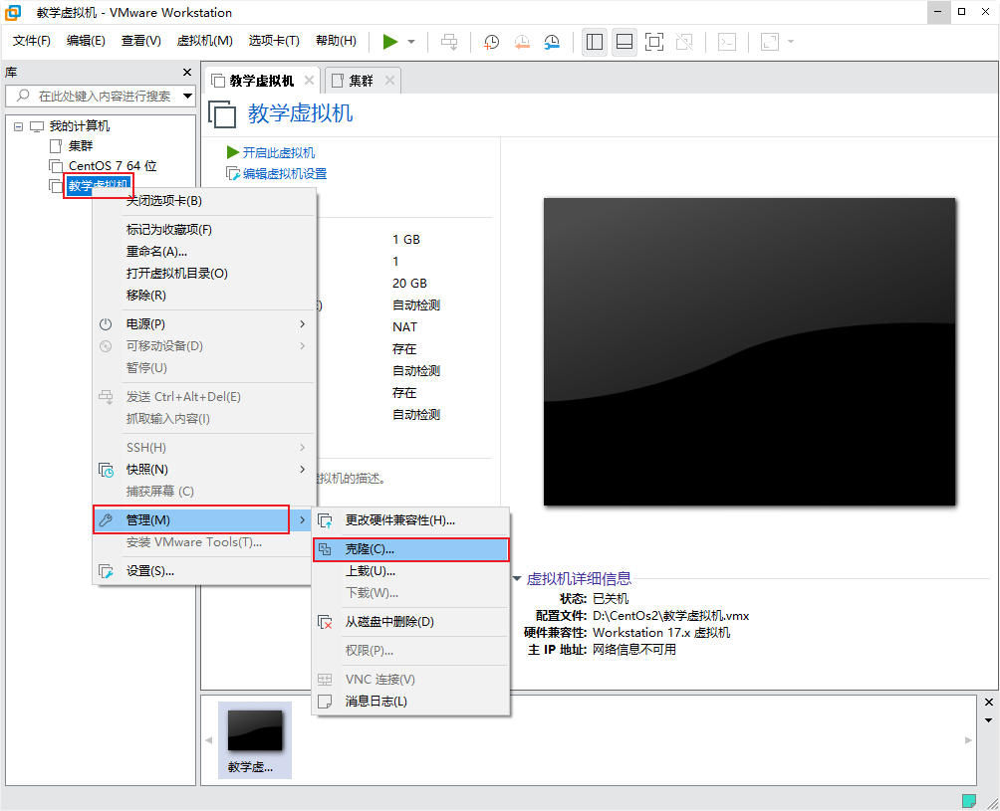

## 集群化环境前置准备

### 介绍

在前面，我们所学习安装的软件，都是以单机模式运行的。

后续，我们将要学习大数据相关的软件部署，所以后续我们所安装的软件服务，大多数都是以集群化（多台服务器共同工作）模式运行的。

所以，在当前小节，我们需要完成集群化环境的前置准备，包括创建多台虚拟机，配置主机名映射，SSH免密登录等等。


### 部署

#### 配置多台Linux虚拟机

安装集群化软件，首要条件就是要有多台Linux服务器可用。

我们可以使用VMware提供的克隆功能，将我们的虚拟机额外克隆出3台来使用。


##### 首先，关机当前CentOS系统虚拟机（可以使用root用户执行init0来快速关机）


##### 新建文件夹


##### 克隆




##### 同样的操作克隆出：`node2`和`node3`


##### 开启`node1`，修改主机名为`node1`，并修改固定ip为：192.168.88.131

```
# 修改主机名
hostnamectl set-hostname node1

# 修改IP地址
vim /etc/sysconfig/network-scripts/ifcfg-ens33
IPADDR="192.168.88.131"

# 重启网卡
systemctl stop network
systemctl start network
# 或者直接
systemctl restart network
```


##### 同样的操作启动node2和node3,

修改node2主机名为node2，设置ip为192.168.88.132

修改node2主机名为node3，设置ip为192.168.88.133


##### 配置FinalShell，配置连接到node1、node2、node3的连接

> 为了简单起见，建议配置root用户登录


#### 准备主机名映射

##### 在Windows系统中修改`hosts`文件，填入如下内容：


```
192.168.88.131 node1
192.168.88.132 node2
192.168.88.133 node3
```


##### 在3台Linux的/etc/hosts文件中，填入如下内容（3台都要添加）

```
192.168.88.131 node1
192.168.88.132 node2
192.168.88.133 node3
```


#### 配置SSH免密登录

##### 简介

SSH服务是一种用于远程登录的安全认证协议。

我们通过FinalShell远程连接到Linux，就是使用的SSH服务。

SSH服务支持：

1. 通过账户+密码的认证方式来做用户认证
2. 通过账户+秘钥文件的方式做用户认证


SSH可以让我们通过SSH命令，远程的登陆到其它的主机上，比如：

在node1执行：`ssh root@node2`，将以root用户登录node2服务器，输入密码即可成功登陆。

或者sshnode2，将以当前用户直接登陆到node2服务器。


##### SSH免密配置

后续安装的集群化软件，多数需要远程登录以及远程执行命令，我们可以简单起见，配置三台Linux服务器之间的免密码互相SSH登陆


1. 在每一台机器都执行：`ssh-keygen -t rsa -b 4096`，一路回车到底即可

2. 在每一台机器都执行：

   ```
   ssh-copy-id node1
   ssh-copy-id node2
   ssh-copy-id node3
   ```

3. 执行完毕后，node1、node2、node3之间将完成root用户之间的免密互通


#### 配置JDK环境

后续的大数据集群软件，多数是需要Java运行环境的，所以我们为每一台机器都配置JDK环境。

JDK配置参阅：Tomcat安装部署环节。

  


#### 关闭防火墙和`SELinux`

集群化软件之间需要通过端口互相通讯，为了避免出现网络不通的问题，我们可以简单的在集群内部关闭防火墙。

`在每一台机器都执行`

```
systemctl stop firewalld
systemctl disable firewalld
```

Linux有一个安全模块：SELinux，用以限制用户和程序的相关权限，来确保系统的安全稳定。

SELinux的配置同防火墙一样，非常复杂，课程中不多涉及，后续视情况可以出一章SELinux的配置课程。

在当前，我们只需要关闭SELinux功能，避免导致后面的软件运行出现问题即可，

`在每一台机器都执行`

```
vim /etc/sysconfig/selinux

# 将第七行，SELINUX=enforcing 改为
SELINUX=disabled
# 保存退出后，重启虚拟机即可，千万要注意disabled单词不要写错，不然无法启动系统
```


#### 添加快照

为了避免后续出现问题，在完成上述设置后，为`每一台虚拟机`都制作快照，留待使用。


## 补充命令- scp

后续的安装部署操作，我们将会频繁的在多台服务器之间相互传输数据。

为了更加方便的互相传输，我们补充一个命令：`scp`

`scp`命令是`cp`命令的升级版，即：ssh cp，通过SSH协议完成文件的复制。

其主要的功能就是：在不同的Linux服务器之间，通过`SSH`协议互相传输文件。

只要知晓服务器的账户和密码（或密钥），即可通过`SCP`互传文件。


语法：

```
scp [-r] 参数1 参数2
- -r选项用于复制文件夹使用，如果复制文件夹，必须使用-r
- 参数1：本机路径 或 远程目标路径
- 参数2：远程目标路径 或 本机路径

如：
scp -r /export/server/jdk root@node2:/export/server/
将本机上的jdk文件夹， 以root的身份复制到node2的/export/server/内
同SSH登陆一样，账户名可以省略（使用本机当前的同名账户登陆）

如：
scp -r node2:/export/server/jdk /export/server/
将远程node2的jdk文件夹，复制到本机的/export/server/内


# scp命令的高级用法
cd /export/server
scp -r jdk node2:`pwd`/    # 将本机当前路径的jdk文件夹，复制到node2服务器的同名路径下
scp -r jdk node2:$PWD      # 将本机当前路径的jdk文件夹，复制到node2服务器的同名路径下
```


## Zookeeper集群安装部署

### 简介

ZooKeeper是一个[分布式](https://baike.baidu.com/item/分布式/19276232?fromModule=lemma_inlink)的，开放源码的[分布式应用程序](https://baike.baidu.com/item/分布式应用程序/9854429?fromModule=lemma_inlink)协调服务，是Hadoop和[Hbase](https://baike.baidu.com/item/Hbase/7670213?fromModule=lemma_inlink)的重要组件。它是一个为分布式应用提供一致性服务的软件，提供的功能包括：配置维护、域名服务、分布式同步、组服务等。

除了为Hadoop和HBase提供协调服务外，Zookeeper也被其它许多软件采用作为其分布式状态一致性的依赖，比如Kafka，又或者一些软件项目中，也经常能见到Zookeeper作为一致性协调服务存在。

Zookeeper不论是大数据领域亦或是其它服务器开发领域，涉及到分布式状态一致性的场景，总有它的身影存在。


### 安装

Zookeeper是一款分布式的集群化软件，可以在多台服务器上部署，并协同组成分布式集群一起工作。


#### 首先，要确保已经完成了`集群化环境前置准备`环节的全部内容

#### 【node1上操作】下载Zookeeper安装包，并解压

```
# 下载
wget http://archive.apache.org/dist/zookeeper/zookeeper-3.5.9/apache-zookeeper-3.5.9-bin.tar.gz

# 确保如下目录存在，不存在就创建
mkdir -p /export/server

# 解压
tar -zxvf apache-zookeeper-3.5.9-bin.tar.gz -C /export/server
```

#### 【node1上操作】创建软链接

```
ln -s /export/server/apache-zookeeper-3.5.9 /export/server/zookeeper
```


#### 【node1上操作】修改配置文件

```
vim /export/server/zookeeper/conf/zoo.cfg

tickTime=2000
# zookeeper数据存储目录
dataDir=/export/server/zookeeper/data
clientPort=2181
initLimit=5
syncLimit=2
server.1=node1:2888:3888
server.2=node2:2888:3888
server.3=node3:2888:3888
```


#### 【node1上操作】配置`myid`

```
# 1. 创建Zookeeper的数据目录
mkdir /export/server/zookeeper/data

# 2. 创建文件，并填入1
vim /export/server/zookeeper/data/myid
# 在文件内填入1即可
```


#### 【在node2和node3上操作】，创建文件夹

```
mkdir -p /export/server
```


#### 【node1上操作】将Zookeeper 复制到node2和node3

```
cd /export/server

scp -r apache-zookeeper-3.5.9 node2:`pwd`/
scp -r apache-zookeeper-3.5.9 node3:`pwd`/
```


#### 【在node2上操作】

```
# 1. 创建软链接
ln -s /export/server/apache-zookeeper-3.5.9 /export/server/zookeeper

# 2. 修改myid文件
vim /export/server/zookeeper/data/myid
# 修改内容为2
```


#### 【在node3上操作】

```
# 1. 创建软链接
ln -s /export/server/apache-zookeeper-3.5.9 /export/server/zookeeper

# 2. 修改myid文件
vim /export/server/zookeeper/data/myid
# 修改内容为3
```


#### 【在node1、node2、node3上分别执行】启动Zookeeper

```
# 启动命令
/export/server/zookeeper/bin/zkServer.sh start		# 启动Zookeeper
```


#### 【在node1、node2、node3上分别执行】检查Zookeeper进程是否启动

```
jps

# 结果中找到有：QuorumPeerMain 进程即可
```


#### 【node1上操作】验证Zookeeper

```
/export/server/zookeeper/zkCli.sh

# 进入到Zookeeper控制台中后，执行
ls /

# 如无报错即配置成功
```


至此`Zookeeper`安装完成。


## Kafka集群安装部署


### 简介

Kafka是一款`分布式的、去中心化的、高吞吐低延迟、订阅模式`的消息队列系统。

同RabbitMQ一样，Kafka也是消息队列。不过RabbitMQ多用于后端系统，因其更加专注于消息的延迟和容错。

Kafka多用于大数据体系，因其更加专注于数据的吞吐能力。

Kafka多数都是运行在分布式（集群化）模式下，所以课程将以3台服务器，来完成Kafka集群的安装部署。


### 安装

#### 确保已经跟随前面的视频，安装并部署了`JDK`和`Zookeeper`服务

> Kafka的运行依赖JDK环境和Zookeeper请确保已经有了JDK环境和Zookeeper

#### 【在node1操作】下载并上传Kafka的安装包

```
# 下载安装包
wget http://archive.apache.org/dist/kafka/2.4.1/kafka_2.12-2.4.1.tgz
```

#### 【在node1操作】解压

```
mkdir -p /export/server			# 此文件夹如果不存在需先创建

# 解压
tar -zxvf kafka_2.12-2.4.1.tgz -C /export/server/

# 创建软链接
ln -s /export/server/kafka_2.12-2.4.1 /export/server/kafkamkdir -p /export/server			# 此文件夹如果不存在需先创建

# 解压
tar -zxvf kafka_2.12-2.4.1.tgz -C /export/server/

# 创建软链接
ln -s /export/server/kafka_2.12-2.4.1 /export/server/kafka
```

#### 【在node1操作】修改Kafka目录内的config目录内的`server.properties`文件

```
cd /export/server/kafka/config
# 指定broker的id
broker.id=1
# 指定 kafka的绑定监听的地址
listeners=PLAINTEXT://node1:9092
# 指定Kafka数据的位置
log.dirs=/export/server/kafka/data
# 指定Zookeeper的三个节点
zookeeper.connect=node1:2181,node2:2181,node3:2181
```


#### 【在node1操作】将node1的kafka复制到node2和node3

```
cd /export/server

# 复制到node2同名文件夹
scp -r kafka_2.12-2.4.1 node2:`pwd`/
# 复制到node3同名文件夹
scp -r kafka_2.12-2.4.1 node3:$PWD
```


